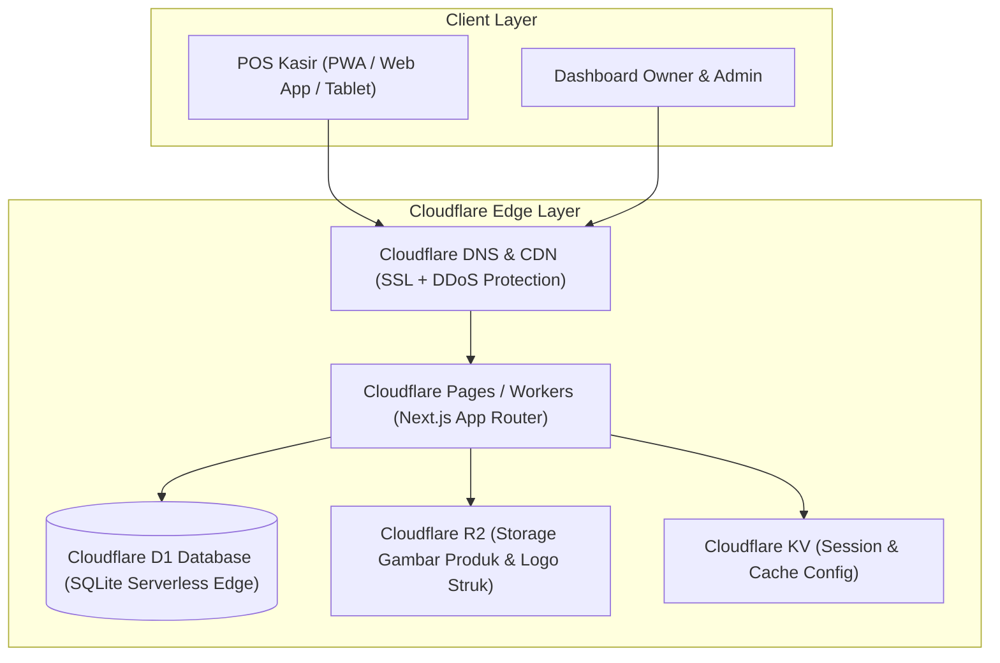
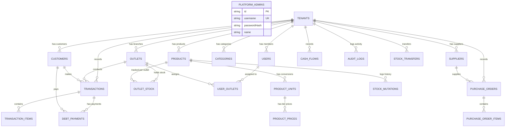

# 🏛️ SDD 00: Overview & Arsitektur Global Sistem

Dokumen ini mendefinisikan arsitektur tingkat tinggi (High-Level Architecture), strategi multi-tenancy, dan prinsip desain untuk SaaS Universal POS & Mini-ERP yang di-hosting di ekosistem **Cloudflare**.

---

## 1. Prinsip Desain Sistem (Design Principles)

1. **Lightweight & No-Bloat**: Menghilangkan alur akuntansi rumit (seperti COA & Jurnal manual di Accurate). Fokus pada 3 esensi bisnis: **Kasir Cepat, Kontrol Stok Realtime, dan Kontrol Kas/Piutang**.
2. **Universal Multi-Business Support**: 1 kode aplikasi yang dapat beradaptasi untuk berbagai tipe ritel:
   - **Minimarket**: Optimasi barcode scanner, shortcut keyboard, checkout di bawah 5 detik.
   - **Toko ATK**: Multi-satuan (Pcs -> Lusin -> Rim -> Dus) dan harga grosir.
   - **Toko Bangunan**: Fleksibilitas satuan (Sak, Batang, M2, Meter), sistem DP (Down Payment), kasbon/piutang bon, dan cetak invoice faktur.
3. **Cloudflare Edge Optimized**: Dirancang serverless dengan latensi minimal di edge network Cloudflare, database serverless SQLite D1 / Postgres, dan konsumsi resource rendah.

---

## 2. Arsitektur Infrastruktur (Cloudflare Stack)

---

## 3. Strategi Multi-Tenancy (Data Isolation)

Aplikasi menggunakan pendekatan **Shared Database, Shared Schema with Tenant Isolation (`tenant_id`)**:
* Setiap request yang masuk membawa context `tenant_id` dari sesi user yang terotentikasi.
* Semua query Drizzle ORM wajib menyertakan filter `where(eq(table.tenantId, currentTenantId))`.
* Menjamin pemisahan data 100% antar toko dengan biaya infrastruktur yang paling efisien (1 database D1 bisa melayani ratusan toko uji coba).

---

## 4. Global Entity Relationship Diagram (ERD)

---

## 5. Ringkasan Modul & Peta Dokumen SDD

| File SDD | Nama Modul | Deskripsi Singkat |
| :--- | :--- | :--- |
| [**`01-modul-auth-tenant.md`**](./01-modul-auth-tenant.md) | Multi-Tenancy & Auth | 3 Role (Owner, Admin, Kasir) & Login Username-Password |
| [**`02-modul-master-produk.md`**](./02-modul-master-produk.md) | Master Produk & Satuan | Satuan bertingkat, tier harga eceran/grosir, barcode. |
| [**`03-modul-kasir-pos.md`**](./03-modul-kasir-pos.md) | Kasir POS & Transaksi | Fast checkout, barcode, bayar tunai/DP/bon, cetak struk. |
| [**`04-modul-piutang-kasbon.md`**](./04-modul-piutang-kasbon.md) | Piutang & Pelunasan | Buku piutang pelanggan, catatan cicilan, limit kredit. |
| [**`05-modul-inventori-stok.md`**](./05-modul-inventori-stok.md) | Stok & Pembelian | Stok opname, barang masuk supplier, kalkulasi HPP. |
| [**`06-modul-laporan-keuangan.md`**](./06-modul-laporan-keuangan.md)| Laporan & Arus Kas | Laba rugi otomatis, kas masuk/keluar, rekap penjualan. |
| [**`07-modul-multi-outlet-monitoring.md`**](./07-modul-multi-outlet-monitoring.md)| Multi-Cabang & Monitoring | Live monitor owner di HP, multi-outlet, transfer stok. |
| [**`08-cakupan-jenis-toko.md`**](./08-cakupan-jenis-toko.md) | Cakupan Toko | 7+ Jenis Toko (Minimarket, Bangunan, ATK, HP, dll). |
| [**`09-onboarding-preset-dan-smart-toggle.md`**](./09-onboarding-preset-dan-smart-toggle.md)| Onboarding Preset | Setup otomatis tipe toko & smart toggle fitur per item. |
| [**`10-rekomendasi-logic-dan-flow-lengkap.md`**](./10-rekomendasi-logic-dan-flow-lengkap.md)| Master Logic & Flow | Blueprint alur bisnis end-to-end lengkap. |
| [**`11-arsitektur-security-dan-anti-fraud.md`**](./11-arsitektur-security-dan-anti-fraud.md)| Security & Anti-Fraud | Blind cash count, HPP masking, data isolation. |
| [**`12-security-hardening-dan-rate-limiting.md`**](./12-security-hardening-dan-rate-limiting.md)| Hardening & Rate Limiting | Cloudflare WAF, sliding window limiter, CSP strict. |
| [**`13-arsitektur-caching-dan-offline-resilience.md`**](./13-arsitektur-caching-dan-offline-resilience.md)| Caching & Offline | 4-layer caching (IndexedDB 0ms scan, D1 atomic write). |
| [**`14-struktur-web-portal-landing-login-dashboard.md`**](./14-struktur-web-portal-landing-login-dashboard.md)| Web Portal Suite | Landing page, login, dashboard terpadu & POS kiosk. |
| [**`15-arsitektur-auth-middleware-session-token.md`**](./15-arsitektur-auth-middleware-session-token.md)| Auth Middleware & Token | JWT stateless `jose` edge cookie & RBAC middleware. |
| [**`16-modul-superadmin-saas-platform.md`**](./16-modul-superadmin-saas-platform.md)| Superadmin SaaS | Portal khusus Bos Besar kelola tenant & Login As Tenant. |
| [**`17-panduan-ui-ux-dan-design-system.md`**](./17-panduan-ui-ux-dan-design-system.md)| UI/UX Design System | Master Toss FinTech aesthetics, tabular nums, anti-slop. |
| [**`18-fitur-pelengkap-export-excel-wa-dan-backup.md`**](./18-fitur-pelengkap-export-excel-wa-dan-backup.md)| Export & Import Excel/PDF | Struk WhatsApp digital, cetak label barcode & backup. |
| [**`19-integrasi-hardware-printer-thermal-bluetooth-usb.md`**](./19-integrasi-hardware-printer-thermal-bluetooth-usb.md)| Hardware Thermal Printer | Cetak via Bluetooth, kabel USB & browser print. |
| [**`20-panduan-deployment-cloudflare-dan-cicd.md`**](./20-panduan-deployment-cloudflare-dan-cicd.md)| Deployment & CI/CD | Runbook deploy Cloudflare Pages, D1 binding & CI/CD. |
| [**`21-modul-audit-log-dan-activity-tracking.md`**](./21-modul-audit-log-dan-activity-tracking.md)| Audit Log Anti-Fraud | Pelacak void, perubahan harga/stok, selisih kasir. |
| [**`22-master-development-roadmap.md`**](./22-master-development-roadmap.md)| Development Roadmap | Peta jalan eksekusi bertahap (Fase 0 - 10) & DoD. |
| [**`23-master-skema-database-d1-drizzle.md`**](./23-master-skema-database-d1-drizzle.md)| Master Skema Database | 20 tabel database Drizzle ORM SQLite single source. |
| [**`24-master-peta-rute-dan-url-aplikasi.md`**](./24-master-peta-rute-dan-url-aplikasi.md)| Master Peta Rute URL | Routing directory, Next.js App Router & RBAC matrix. |
| [**`README.md`**](./README.md)| Master Index Hub | Katalog utama dan peta navigasi seluruh modul SDD. |
