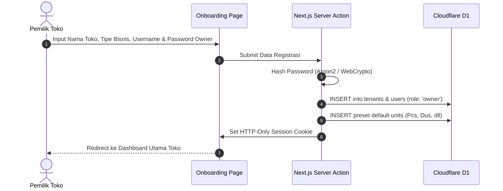
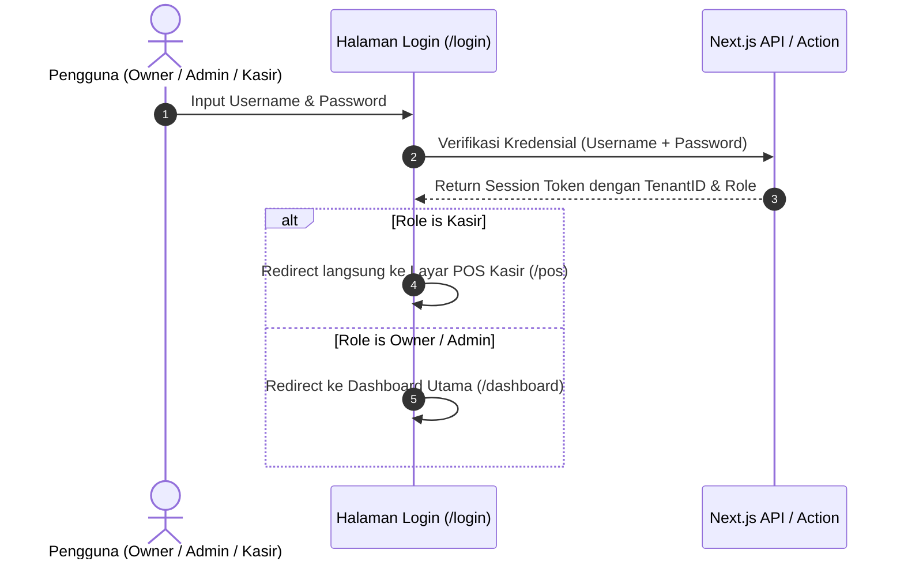

# 🔐 SDD 01: Modul Multi-Tenant & Otentikasi

Dokumen ini menjelaskan alur pendaftaran toko (onboarding), manajemen multi-cabang/outlet, pembagian peran pengguna (RBAC), dan arsitektur otentikasi di Cloudflare Edge.

---

## 1. Scope & Kebutuhan Fitur

1. **Registrasi Toko (Onboarding Sederhana)**:
   - Form pendaftaran: Nama Toko, Kategori Bisnis (*Minimarket / Toko ATK / Toko Bangunan / Ritel Umum*), Alamat, No. Telp, Email & Password Owner.
   - Pilihan Kategori Bisnis otomatis mengatur preset satuan awal (misal jika pilih Toko Bangunan -> langsung aktif satuan Sak, Batang, Meter, Pcs).
2. **Role & Permission Matrix (RBAC: Owner, Admin, Kasir)**:

| Menu / Fitur | Owner (Pemilik) | Admin (Manajer Cabang) | Kasir (Cashier) |
| :--- | :---: | :---: | :---: |
| **Layar POS Kasir (/pos)** | ✅ | ✅ | ✅ |
| **Buka/Tutup Shift & Kas Laci** | ✅ | ✅ | ✅ |
| **Master Data Produk & Satuan** | ✅ | ✅ (Bisa Tambah/Edit) | ❌ (Hanya Baca di POS) |
| **Barang Masuk / Pembelian Supplier** | ✅ | ✅ | ❌ |
| **Stok Opname & Penyesuaian** | ✅ | ✅ | ❌ |
| **Buku Piutang & Catat Cicilan** | ✅ | ✅ | ⚠️ (Bisa catat DP saat kasir) |
| **Laporan Penjualan Cabang** | ✅ (Semua Cabang) | ✅ (Cabang Sendiri) | ⚠️ (Hanya Shift Sendiri) |
| **Laporan Laba/Rugi & HPP** | ✅ | ❌ (Tersembunyi) | ❌ (Tersembunyi) |
| **Manajemen Karyawan & Cabang** | ✅ | ❌ | ❌ |

3. **Session & Security di Cloudflare Edge**:
   - Stateless JWT cookie dengan enkripsi yang ringan untuk Cloudflare Workers/Edge runtime.

---

## 2. Skema Database Drizzle (D1 SQLite)

```typescript
// schema/auth.ts
import { sqliteTable, text, integer } from 'drizzle-orm/sqlite-core';

export const tenants = sqliteTable('tenants', {
  id: text('id').primaryKey(), // nanoid or uuid
  name: text('name').notNull(),
  businessType: text('business_type').notNull(), // 'minimarket' | 'atk' | 'building' | 'general'
  phone: text('phone'),
  address: text('address'),
  receiptFooter: text('receipt_footer').default('Terima kasih atas kunjungan Anda'),
  createdAt: integer('created_at', { mode: 'timestamp' }).$defaultFn(() => new Date()),
});

export const users = sqliteTable('users', {
  id: text('id').primaryKey(),
  tenantId: text('tenant_id').notNull().references(() => tenants.id, { onDelete: 'cascade' }),
  name: text('name').notNull(),
  username: text('username').notNull(), // username untuk login (e.g. 'kasir1', 'budi', 'admin_toko')
  email: text('email'), // opsional untuk kasir/admin, wajib untuk owner
  passwordHash: text('password_hash').notNull(),
  role: text('role', { enum: ['owner', 'admin', 'cashier'] }).default('cashier').notNull(),
  isActive: integer('is_active', { mode: 'boolean' }).default(true).notNull(),
  createdAt: integer('created_at', { mode: 'timestamp' }).$defaultFn(() => new Date()),
});
```

---

## 3. Alur Kerja (Workflows)

### A. Flow Registrasi & Onboarding Toko Baru


### B. Flow Login (Owner, Admin, Kasir)

