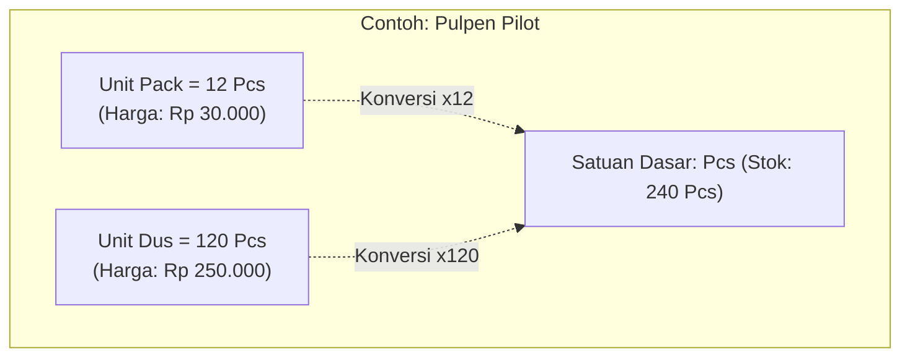

# 📦 SDD 02: Modul Master Produk, Multi-Satuan & Multi-Harga

Dokumen ini mengatur struktur katalog produk, hierarki satuan bertingkat (konversi otomatis), dan tier harga eceran vs grosir.

---

## 1. Scope & Tantangan Kunci

1. **Multi-Satuan Bertingkat (Hierarchical Units)**:
   - **Toko ATK**: Satuan Dasar: `Pcs`. Satuan Tambahan: `Pack` (1 Pack = 10 Pcs), `Dus` (1 Dus = 100 Pcs).
   - **Toko Bangunan**: Satuan Dasar: `Kg` atau `Pcs`. Satuan Tambahan: `Sak` (1 Sak = 50 Kg), `Batang` (1 Batang = 6 Meter).
   - **Stok Fisik di Database**: Selalu disimpan dalam **Satuan Dasar (Base Unit)** untuk menghindari inkonsistensi stok saat dijual dalam satuan apapun.
2. **Multi-Tier Pricing (Grosir vs Eceran)**:
   - Harga Normal (Eceran): Berlaku jika beli di bawah minimum qty.
   - Harga Grosir / Pelanggan: Berlaku otomatis jika kasir memasukkan Qty >= Qty Grosir atau pelanggan berstatus "Toko/Langganan".
3. **Barcode & Kode SKU**:
   - Mendukung pencarian instan via scanner barcode (EAN-13, Code 128) atau kode manual/nama barang.

---

## 2. Skema Database Drizzle (D1 SQLite)

```typescript
// schema/products.ts
import { sqliteTable, text, integer, real } from 'drizzle-orm/sqlite-core';
import { tenants } from './auth';

export const categories = sqliteTable('categories', {
  id: text('id').primaryKey(),
  tenantId: text('tenant_id').notNull().references(() => tenants.id, { onDelete: 'cascade' }),
  name: text('name').notNull(),
});

export const products = sqliteTable('products', {
  id: text('id').primaryKey(),
  tenantId: text('tenant_id').notNull().references(() => tenants.id, { onDelete: 'cascade' }),
  categoryId: text('category_id').references(() => categories.id),
  name: text('name').notNull(),
  barcode: text('barcode'), // unique per tenant
  baseUnit: text('base_unit').default('pcs').notNull(), // 'pcs', 'kg', 'meter', 'lembar'
  currentStock: real('current_stock').default(0).notNull(), // stored in base unit
  minStockAlert: real('min_stock_alert').default(5),
  costPrice: real('cost_price').default(0).notNull(), // HPP per base unit
  isActive: integer('is_active', { mode: 'boolean' }).default(true).notNull(),
  createdAt: integer('created_at', { mode: 'timestamp' }).$defaultFn(() => new Date()),
});

// Satuan tambahan (misal: Pack, Dus, Sak, Rim)
export const productUnits = sqliteTable('product_units', {
  id: text('id').primaryKey(),
  productId: text('product_id').notNull().references(() => products.id, { onDelete: 'cascade' }),
  unitName: text('unit_name').notNull(), // misal 'dus'
  conversionQty: real('conversion_qty').notNull(), // 1 dus = 24 base unit
  barcode: text('barcode'), // barcode khusus satuan dus jika ada
});

// Tier harga per satuan
export const productPriceTiers = sqliteTable('product_price_tiers', {
  id: text('id').primaryKey(),
  productId: text('product_id').notNull().references(() => products.id, { onDelete: 'cascade' }),
  productUnitId: text('product_unit_id').references(() => productUnits.id, { onDelete: 'cascade' }), // null jika base unit
  tierName: text('tier_name').default('ecer').notNull(), // 'ecer', 'grosir', 'langganan'
  minQty: real('min_qty').default(1).notNull(),
  price: real('price').notNull(),
});
```

---

## 3. Logika Perhitungan Multi-Satuan (Real-World Examples)

### Aturan Emas (The Golden Rule):
> **"Stok Fisik di Database SELALU disimpan dalam Satuan Terkecil (Base Unit)."**
> Mau barang dibeli dalam satuan Dus/Sak, atau dijual dalam satuan Ecer/Pack/Meter, sistem secara otomatis mengalikan dengan `conversionQty` saat memotong atau menambah stok!



### Simulasi 3 Kasus Nyata:

#### 1. Toko ATK (Pulpen)
* **Setup Satuan**:
  * Satuan Dasar: `Pcs` (Harga Jual: Rp 3.000)
  * Satuan Tambahan 1: `Pack` = 12 Pcs (Harga Jual: Rp 30.000)
  * Satuan Tambahan 2: `Dus` = 120 Pcs (Harga Jual: Rp 250.000)
* **Di Kasir**:
  * Jika kasir input `2 Pack` ➔ Sistem menagih `2 x Rp 30.000 = Rp 60.000`, dan stok fisik terpotong `2 x 12 = 24 Pcs`.

#### 2. Toko Bangunan (Semen & Pasir)
* **Setup Satuan**:
  * Satuan Dasar: `Kg`
  * Satuan Tambahan: `Sak 50Kg` = 50 Kg (Harga Jual: Rp 65.000)
* **Di Kasir**:
  * Pembeli beli `3 Sak` ➔ Tagihan: `3 x Rp 65.000 = Rp 195.000`, stok fisik terpotong `3 x 50 = 150 Kg`.
  * Pembeli beli eceran `5 Kg` ➔ Tagihan eceran Kg, stok fisik terpotong `5 Kg`.

#### 3. Toko Listrik (Kabel Listrik)
* **Setup Satuan**:
  * Satuan Dasar: `Meter` (Harga Jual Ecer: Rp 8.000 / meter)
  * Satuan Tambahan: `Rol 100M` = 100 Meter (Harga Jual: Rp 700.000 / rol)
* **Di Kasir**:
  * Kasir jual `15 Meter` ➔ Stok terpotong 15 Meter.
  * Kasir jual `1 Rol` ➔ Stok terpotong 100 Meter.

---

## 4. Tampilan Dropdown Kasir POS (UX Simpel)

Di keranjang kasir, kasir tinggal klik dropdown satuan pada item tersebut:
```
[ Pulpen Pilot G-2 ]   Qty: [ 2 ]   Satuan: [ Pack  ▾ ]   @ Rp 30.000   Total: Rp 60.000
                                            │ Pcs     │
                                            │ Pack    │
                                            │ Dus     │
```
Ketika satuan diganti, harga satuan dan subtotal otomatis berubah detik itu juga!
