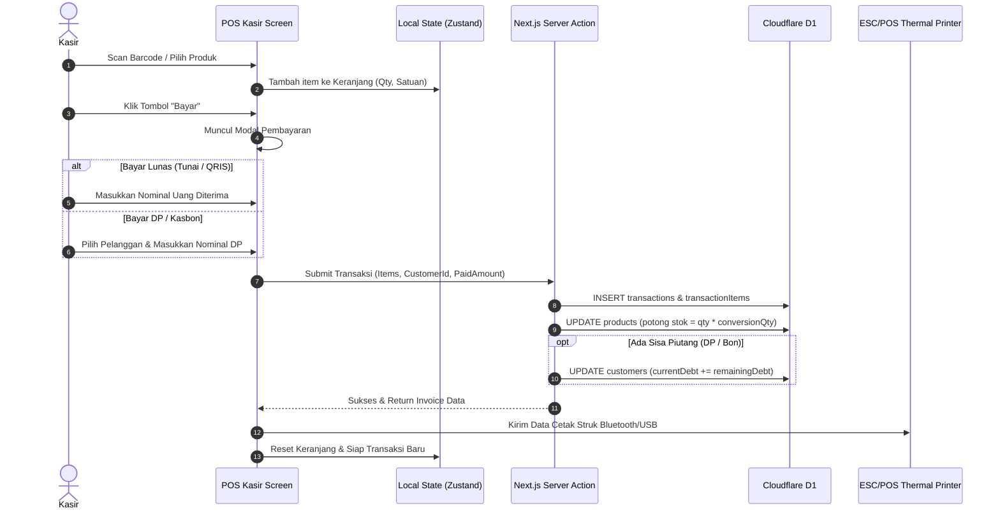

# 🛒 SDD 03: Modul Kasir POS & Transaksi Penjualan

Dokumen ini menjelaskan alur interaksi antarmuka kasir (POS), pemrosesan keranjang belanja, integrasi hardware (barcode & printer thermal), serta mode pembayaran lunas vs DP / piutang.

---

## 1. Fitur Utama Layar Kasir POS

1. **Quick Product Lookup & Barcode Scanning**:
   - Auto-focus pada field input scan barcode.
   - Scan barcode langsung memasukkan produk ke keranjang (+1 Qty atau sesuai satuan barcode).
   - Pencarian manual dengan autocomplete cepat (nama produk, kategori, atau kode).
2. **Fleksibilitas Keranjang Belanja (Cart)**:
   - Dropdown ganti satuan secara instan di setiap item (misal ubah dari `Pcs` ke `Dus`).
   - Penyesuaian Diskon per item (Nominal Rp atau Persen %).
   - Tombol Hold Bill / Simpan Antrean (berguna saat pembeli minimarket lupa ambil barang lain).
3. **Mode Pembayaran Fokus Tunai (Cash-First & Quick Buttons)**:
   - **Tunai Penuh (Cash)**:
     - Input nominal uang yang diserahkan pembeli.
     - **Tombol Uang Pas Cepat**: `[ Uang Pas ]`, `[ Rp 10.000 ]`, `[ Rp 20.000 ]`, `[ Rp 50.000 ]`, `[ Rp 100.000 ]`.
     - **Kalkulator Kembalian Otomatis**: Menampilkan nominal kembalian dengan angka besar dan jelas agar kasir tidak salah memberikan kembalian.
   - **Tunai DP (Down Payment)**:
     - Pembeli bayar DP tunai (misal DP Rp 100.000), sisa tagihan dicatat ke Piutang Pelanggan.
   - **Kasbon / Piutang Penuh**:
     - Memilih nama Pelanggan, seluruh tagihan masuk ke buku piutang pelanggan.
   *(Catatan: Metode Non-Tunai seperti QRIS / Transfer disiapkan sebagai modul ekstensi di fase selanjutnya).*
4. **Cetak Nota & Invoice**:
   - **Thermal Printer (58mm / 80mm)** via Web Bluetooth / USB ESC-POS.
   - **Invoice Faktur A4 / Surat Jalan** (cetak ke PDF/printer biasa untuk toko bangunan & grosir).

---

## 2. Skema Database Transaksi Drizzle (D1 SQLite)

```typescript
// schema/transactions.ts
import { sqliteTable, text, integer, real } from 'drizzle-orm/sqlite-core';
import { tenants, users } from './auth';
import { products } from './products';

export const customers = sqliteTable('customers', {
  id: text('id').primaryKey(),
  tenantId: text('tenant_id').notNull().references(() => tenants.id, { onDelete: 'cascade' }),
  name: text('name').notNull(),
  phone: text('phone'),
  address: text('address'),
  debtLimit: real('debt_limit').default(0), // 0 = tidak ada limit
  currentDebt: real('current_debt').default(0).notNull(), // saldo hutang aktif
  createdAt: integer('created_at', { mode: 'timestamp' }).$defaultFn(() => new Date()),
});

export const transactions = sqliteTable('transactions', {
  id: text('id').primaryKey(),
  tenantId: text('tenant_id').notNull().references(() => tenants.id, { onDelete: 'cascade' }),
  userId: text('user_id').notNull().references(() => users.id), // kasir
  customerId: text('customer_id').references(() => customers.id), // opsional (wajib jika piutang/DP)
  invoiceNo: text('invoice_no').notNull(), // Contoh: INV-20260829-0001
  subtotal: real('subtotal').notNull(),
  discount: real('discount').default(0).notNull(),
  total: real('total').notNull(),
  paidAmount: real('paid_amount').notNull(), // uang yang diserahkan pembeli
  changeAmount: real('change_amount').default(0).notNull(), // kembalian
  remainingDebt: real('remaining_debt').default(0).notNull(), // jika total > paidAmount
  paymentMethod: text('payment_method').notNull(), // 'CASH' | 'QRIS' | 'TRANSFER' | 'DEBT' | 'DP'
  paymentStatus: text('payment_status').default('PAID').notNull(), // 'PAID' | 'PARTIAL' | 'UNPAID'
  notes: text('notes'),
  createdAt: integer('created_at', { mode: 'timestamp' }).$defaultFn(() => new Date()),
});

export const transactionItems = sqliteTable('transaction_items', {
  id: text('id').primaryKey(),
  transactionId: text('transaction_id').notNull().references(() => transactions.id, { onDelete: 'cascade' }),
  productId: text('product_id').notNull().references(() => products.id),
  unitName: text('unit_name').notNull(), // 'pcs', 'dus', 'sak'
  conversionQty: real('conversion_qty').default(1).notNull(), // pengali ke base unit
  qty: real('qty').notNull(),
  pricePerUnit: real('price_per_unit').notNull(),
  costPrice: real('cost_price').notNull(), // HPP saat transaksi terjadi (untuk laba/rugi akurat)
  subtotal: real('subtotal').notNull(),
});
```

---

## 3. Flow Checkout Kasir (Sequence Diagram)


