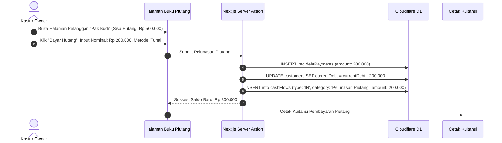

# 📑 SDD 04: Modul Piutang & Kasbon (Buku Bon Pelanggan)

Dokumen ini mendesain sistem pengelolaan piutang yang sangat krusial bagi Toko Bangunan, Toko ATK, dan Grosir, di mana pelanggan rutin mengambil barang dulu dan melunasinya secara berkala / cicilan.

---

## 1. Fitur Kunci Buku Piutang

1. **Dashboard Piutang Pelanggan**:
   - Total Keseluruhan Piutang Toko yang belum tertagih.
   - Daftar pelanggan berhutang yang diurutkan berdasarkan saldo terbesar atau jatuh tempo terdekat.
   - Indikator peringatan jika piutang pelanggan mendekati/melebihi `debtLimit` (Limit Kredit).
2. **Riwayat Faktur Belum Lunas**:
   - Detail faktur mana saja yang belum lunas beserta barang apa yang dibeli.
3. **Pencatatan Cicilan / Pelunasan (1-Klik)**:
   - Pelanggan bisa membayar spesifik per Faktur atau bayar deposit/cicil umum yang memotong saldo piutang tertua (*FIFO Debt Settlement*).
   - Metode bayar pelunasan: Tunai / Transfer Bank / QRIS.
   - Cetak Kuitansi / Bukti Pembayaran Piutang.

---

## 2. Skema Database Pembayaran Piutang (D1 SQLite)

```typescript
// schema/debts.ts
import { sqliteTable, text, integer, real } from 'drizzle-orm/sqlite-core';
import { tenants, users } from './auth';
import { customers, transactions } from './transactions';

export const debtPayments = sqliteTable('debt_payments', {
  id: text('id').primaryKey(),
  tenantId: text('tenant_id').notNull().references(() => tenants.id, { onDelete: 'cascade' }),
  customerId: text('customer_id').notNull().references(() => customers.id, { onDelete: 'cascade' }),
  transactionId: text('transaction_id').references(() => transactions.id), // opsional jika cicilan per faktur
  receivedByUserId: text('received_by_user_id').notNull().references(() => users.id),
  receiptNo: text('receipt_no').notNull(), // Contoh: PAY-20260829-001
  amountPaid: real('amount_paid').notNull(),
  paymentMethod: text('payment_method').notNull(), // 'CASH' | 'TRANSFER' | 'QRIS'
  notes: text('notes'),
  paymentDate: integer('payment_date', { mode: 'timestamp' }).$defaultFn(() => new Date()),
});
```

---

## 3. Flow Pelunasan Piutang (Sequence Diagram)


