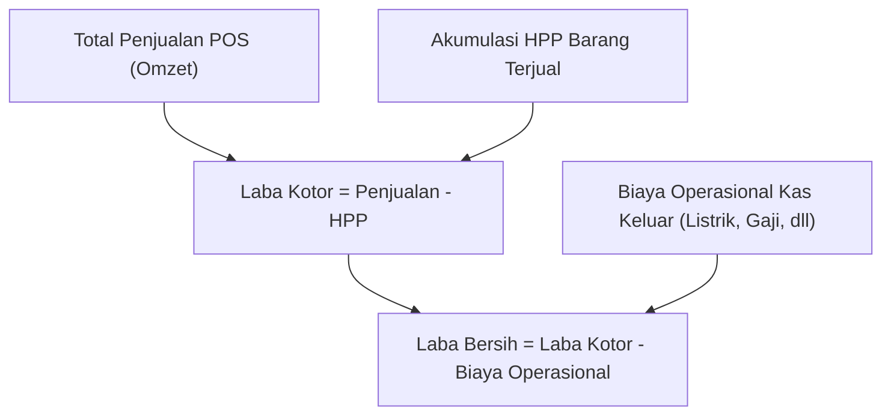

# 📊 SDD 06: Modul Laporan & Arus Kas Sederhana

Dokumen ini mendefinisikan laporan performa bisnis dan arus kas operasional toko tanpa memerlukan pemahaman akuntansi rumit (bebas dari entri jurnal debit/kredit manual).

---

## 1. Fitur Utama Laporan Finansial Toko

1. **Laporan Laba / Rugi Otomatis**:
   - **Total Omzet (Penjualan Bersih)**: Total penjualan lunas + penjualan dengan DP/Piutang.
   - **Total HPP (Beban Pokok Penjualan)**: Akumulasi modal dari seluruh barang yang terjual.
   - **Laba Kotor**: $\text{Omzet} - \text{HPP}$.
   - **Biaya Operasional (Beban Toko)**: Listrik, gaji staf, sewa, plastik/packing, bensin delivery.
   - **Laba Bersih**: $\text{Laba Kotor} - \text{Biaya Operasional}$.
2. **Buku Kas Masuk / Kas Keluar (Cash Flow Kasir & Toko)**:
   - Kas Masuk: Penjualan Tunai, Pelunasan Piutang, Modal Awal Kasir.
   - Kas Keluar: Pengeluaran Toko harian, Pembayaran ke Supplier, Pengambilan Prive Owner.
   - Rekonsiliasi Kas Kasir (Perhitungan fisik laci uang kasir saat tutup shift).
3. **Laporan Penjualan & Analisis Produk**:
   - Top 10 Produk Terlaris (Fast-moving items).
   - Penjualan per Kategori dan per Kasir.
   - Total Piutang Aktif dan Umur Piutang.

---

## 2. Skema Database Arus Kas Drizzle (D1 SQLite)

```typescript
// schema/finance.ts
import { sqliteTable, text, integer, real } from 'drizzle-orm/sqlite-core';
import { tenants, users } from './auth';

export const cashFlows = sqliteTable('cash_flows', {
  id: text('id').primaryKey(),
  tenantId: text('tenant_id').notNull().references(() => tenants.id, { onDelete: 'cascade' }),
  userId: text('user_id').notNull().references(() => users.id),
  type: text('type').notNull(), // 'IN' (Kas Masuk) | 'OUT' (Kas Keluar)
  category: text('category').notNull(), // 'Penjualan', 'Pelunasan Piutang', 'Operasional', 'Listrik', 'Gaji', 'Bahan Baku'
  amount: real('amount').notNull(),
  paymentMethod: text('payment_method').default('CASH').notNull(), // 'CASH' | 'TRANSFER'
  referenceType: text('reference_type'), // 'TRANSACTION' | 'DEBT_PAYMENT' | 'PURCHASE' | 'MANUAL'
  referenceId: text('reference_id'),
  description: text('description'),
  transactionDate: integer('transaction_date', { mode: 'timestamp' }).$defaultFn(() => new Date()),
});
```

---

## 3. Alur Perhitungan Laba Rugi Realtime



Semua data ini langsung disajikan dalam dashboard visual yang mudah dipahami pemilik toko (grafik chart harian/bulanan, kartu metrik omzet, laba kotor, dan total piutang aktif).

---

## 4. Struktur Modul Laporan Finansial & Rekap Penjualan (v1.3.0)

### 4.1 Laporan Laba Rugi (Profit & Loss / P&L)
1. **Filter Rentang Waktu Interaktif**:
   - `Hari Ini`, `7 Hari Terakhir`, `Bulan Ini`, `Bulan Lalu`, `Semua`, dan `Kustom` (DatePicker Dari ➔ Sampai).
   - Pembaruan realtime tanpa kedipan loading / transisi lambat.
2. **4 Bento StatCard Reusable**:
   - **Total Omzet Penjualan**: Nilai kotor transaksi masuk.
   - **Total HPP Modal Pokok**: Snapshot harga modal barang yang terjual.
   - **Beban Operasional Toko**: Total kas keluar operasional.
   - **Laba Bersih Realtime**: Dilengkapi metrik *Gross Margin %* dan *Net Margin %*.
3. **Analisis Proporsi Beban Kas (Expense Breakdown)**:
   - Visualisasi persentase beban operasional per kategori pos biaya (Listrik & Air, Gaji Karyawan, Plastik, Sewa, dll) dengan progress bar proporsional.
4. **Top Produk Terlaris & Histori Pengeluaran Kas Terakhir**.

### 4.2 Rekap Penjualan & Audit Kasir (Sales Summary & Cash Audit)
1. **4 Reusable StatCard Kanal Pembayaran**:
   - **Uang Tunai Kasir** (`Banknote`, hijau): Saldo fisik laci kasir untuk rekonsiliasi kas harian.
   - **QRIS Digital** (`QrCode`, biru): Transaksi non-tunai via QRIS.
   - **Transfer Bank** (`CreditCard`, ungu): Transaksi langsung rekening toko.
   - **Kasbon / Piutang** (`Receipt`, oranye): Penjualan tempo/bon yang dialirkan ke Buku Piutang.
2. **Log Transaksi Penjualan Per-Struk (Detail Audit Struk)**:
   - Pencarian realtime No. Invoice, Nama Kasir, atau Nama Pelanggan.
   - Filter dropdown metode pembayaran.
   - Tombol **`<Eye />`**: Membuka **Modal Detail Transaksi** berisi daftar rincian barang belanjaan (Nama produk, SKU, Qty, Satuan, Harga, Subtotal), rincian diskon, jumlah bayar, kembalian, dan tombol buka struk.
   - Tombol **`<Receipt />`**: Membuka rute faktur struk thermal untuk dicetak ulang (`/dashboard/invoice/[id]`).
3. **Tabel Performa Omzet Berdasarkan Kasir**:
   - Menghitung kontribusi omzet dan kuantitas transaksi selesai per staf kasir.
   - Tombol **`<Eye />`**: Membuka **Modal Detail Performa Kasir** yang dilengkapi:
     - Profil kasir terdaftar.
     - Metrik ringkasan (Total Transaksi, Total Omzet, Rata-rata per Struk).
     - **Daftar Riwayat Struk Kasir Terpilih**: Menampilkan seluruh struk transaksi yang diproses oleh kasir tersebut dengan aksi cepat lihat detail item belanja (`<Eye />`) dan cetak nota struk (`<Receipt />`).
4. **Resilient Safe-Return Data Pattern**:
   - Query Server Action menerapkan normalisasi data JSON murni dengan penanganan error terstruktur (`{ success: true, transaction, items }`), menjamin nol risiko error *500 Internal Server Error* pada Turbopack.

