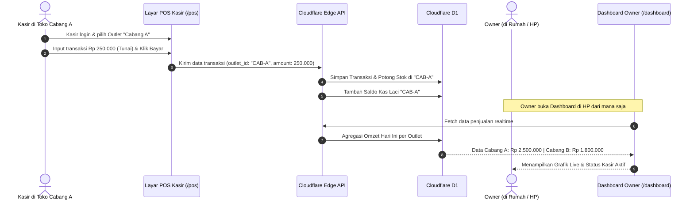

# 🏢 SDD 07: Modul Multi-Outlet, Live Monitoring Owner & Transfer Stok

Dokumen ini menjelaskan bagaimana seorang Pemilik Bisnis (Owner) dapat memantau beberapa cabang/outlet toko secara realtime dalam 1 akun SaaS, serta bagaimana aliran penjualan dari tiap toko masuk ke dashboard pusat.

---

## 1. Konsep Hirarki Organisasi (Multi-Outlet Hierarchy)

```
[Tenant / Perusahaan Milik Owner]  (Contoh: "TB Sumber Berkah Group")
   │
   ├── 🏬 Outlet 1: Toko Pusat (Minimarket + Material)
   │     ├── Kasir: Siti (Shift Pagi)
   │     ├── Stok Fisik Cabang 1
   │     └── Kas Laci Cabang 1
   │
   ├── 🏬 Outlet 2: Cabang Pasar (Khusus Grosir ATK)
   │     ├── Kasir: Budi
   │     ├── Stok Fisik Cabang 2
   │     └── Kas Laci Cabang 2
   │
   └── 🏭 Gudang Pusat (Central Warehouse)
         └── Penanggung Jawab: Pak Agus (Staf Gudang)
```

---

## 2. Alur Kerja (End-to-End Flow)

### A. Alur Kasir Bertransaksi di Toko Cabang ➔ Owner Memantau Live


---

## 3. Fitur Kunci untuk Owner & Multi-Outlet

### 1. **Live Executive Dashboard (Pantauan Owner dari HP/Laptop)**
* **Switcher Outlet Cepat**: Opsi filter *"Semua Cabang (Konsolidasian)"* atau pilih spesifik *"Toko Cabang A"*.
* **Live Sales Ticker**: Notifikasi ringkas setiap ada transaksi baru di cabang manapun.
* **Komparasi Kinerja Toko**: Peringkat toko dengan penjualan tertinggi dan profit margin terbaik hari ini.
* **Monitoring Kas Laci Kasir**: Mengetahui berapa uang fisik yang seharusnya ada di laci kasir tiap cabang saat ini.

### 2. **Master Produk Terpusat vs Stok per Cabang**
* Owner cukup input produk 1 kali di Master Katalog (tidak perlu input ulang nama/barcode di tiap cabang).
* Stok dikelola secara mandiri per cabang (`branch_stock`).
* Harga jual bisa diseragamkan atau di-override khusus untuk cabang tertentu jika dibutuhkan.

### 3. **Mutasi & Transfer Stok Antar Cabang**
* Toko Cabang A kehabisan semen ➔ Minta transfer stok dari Gudang Pusat atau Toko Cabang B.
* Alur: **Buat Permintaan Transfer ➔ Kirim Barang (Status: In Transit) ➔ Cabang Penerima Klik Terima ➔ Stok otomatis berpindah**.

### 4. **Laporan Tutup Shift & Notifikasi Ringkas**
* Setiap kasir tutup shift, sistem menghitung:
  * Total Penjualan Tunai vs Non-Tunai (QRIS/Transfer).
  * Uang Fisik yang Dihitung Kasir vs Uang Seharusnya di Sistem (Deteksi Selisih Kasir).
* Sistem dapat mengirimkan **Ringkasan Penutupan Kasir langsung ke WhatsApp/Telegram Owner**.

---

## 4. Skema Database Drizzle untuk Multi-Outlet

```typescript
// schema/outlets.ts
import { sqliteTable, text, integer, real } from 'drizzle-orm/sqlite-core';
import { tenants, users } from './auth';
import { products } from './products';

// Data Cabang / Outlet / Toko
export const outlets = sqliteTable('outlets', {
  id: text('id').primaryKey(),
  tenantId: text('tenant_id').notNull().references(() => tenants.id, { onDelete: 'cascade' }),
  name: text('name').notNull(), // Contoh: 'Toko Utama', 'Cabang Pasar', 'Gudang Pusat'
  type: text('type').default('STORE').notNull(), // 'STORE' | 'WAREHOUSE'
  address: text('address'),
  phone: text('phone'),
  isActive: integer('is_active', { mode: 'boolean' }).default(true).notNull(),
  createdAt: integer('created_at', { mode: 'timestamp' }).$defaultFn(() => new Date()),
});

// Penugasan Kasir/Staff ke Cabang tertentu
export const userOutlets = sqliteTable('user_outlets', {
  id: text('id').primaryKey(),
  userId: text('user_id').notNull().references(() => users.id, { onDelete: 'cascade' }),
  outletId: text('outlet_id').notNull().references(() => outlets.id, { onDelete: 'cascade' }),
  isDefault: integer('is_default', { mode: 'boolean' }).default(true).notNull(),
});

// Stok Fisik per Cabang
export const outletStock = sqliteTable('outlet_stock', {
  id: text('id').primaryKey(),
  outletId: text('outlet_id').notNull().references(() => outlets.id, { onDelete: 'cascade' }),
  productId: text('product_id').notNull().references(() => products.id, { onDelete: 'cascade' }),
  stock: real('stock').default(0).notNull(), // dalam base unit
  minStockAlert: real('min_stock_alert').default(5),
});

// Transfer Stok Antar Cabang
export const stockTransfers = sqliteTable('stock_transfers', {
  id: text('id').primaryKey(),
  tenantId: text('tenant_id').notNull().references(() => tenants.id, { onDelete: 'cascade' }),
  fromOutletId: text('from_outlet_id').notNull().references(() => outlets.id),
  toOutletId: text('to_outlet_id').notNull().references(() => outlets.id),
  transferNumber: text('transfer_number').notNull(), // TRF-20260829-001
  status: text('status').default('PENDING').notNull(), // 'PENDING' | 'IN_TRANSIT' | 'COMPLETED' | 'CANCELLED'
  notes: text('notes'),
  createdByUserId: text('created_by_user_id').notNull().references(() => users.id),
  createdAt: integer('created_at', { mode: 'timestamp' }).$defaultFn(() => new Date()),
});
```
