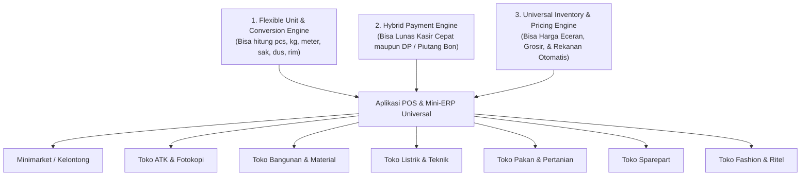

# 🏪 SDD 08: Cakupan Scope Jenis Toko & Solusi Fitur Spesifik

Dokumen ini memetakan seluruh jenis toko (vertikal bisnis) yang dapat dilayani oleh SaaS Universal POS & Mini-ERP ini, beserta fitur spesifik yang menjawab kebutuhan masing-masing bisnis.

---

## 1. Matriks Cakupan Toko & Fitur Kunci

| Tipe Toko | Kebutuhan Utama Toko | Fitur Solusi di SaaS Kita |
| :--- | :--- | :--- |
| **1. Minimarket & Toko Kelontong** | Transaksi super cepat (< 5 detik), scan barcode, uang pas/kembalian, hold bill antrean. | Fast barcode auto-focus, shortcut hotkey kasir, struk thermal 58mm cepat, pending bill. |
| **2. Toko ATK (Alat Tulis Kantor)** | Satuan bertingkat (*Pcs, Lusin, Rim, Dus*), harga grosir sekolah/kantor, nota resmi. | Multi-satuan bertingkat & konversi otomatis, tier harga grosir otomatis by qty, cetak faktur A4. |
| **3. Toko Bangunan & Material** | Satuan custom (*Sak, Batang, Meter, Kg, M2*), DP/Kasbon proyek tukang, surat jalan. | Satuan fleksibel (decimal support), mode DP & Piutang, cetak Faktur / Delivery Order. |
| **4. Toko Listrik & Elektronik Kecil** | Penjualan kabel meteran vs rol, lampu, stop kontak, harga khusus teknisi listrik. | Konversi meter ke rol, tier harga khusus teknisi/rekanan, cetak nota garansi toko. |
| **5. Toko Pakan Ternak, Pupuk & Pet Shop** | Penjualan karung/sak vs eceran kiloan, obat/vitamin sachet, bon peternak/petani. | Konversi Sak ke Kg, buku piutang pelanggan, pencatatan expired date sederhana. |
| **6. Toko Sparepart & Aksesoris Motor** | Ribuan SKU barang, harga grosir bengkel vs umum, bon bengkel rekanan. | Pencarian SKU/Nama instan, multi-tier harga pelanggan bengkel, catatan piutang. |
| **7. Toko HP, Gadget & Aksesoris** | Input nomor IMEI/Serial Number per unit HP (untuk garansi nota), penjualan aksesoris (kabel, tempered glass), varian memori/warna. | Tracking IMEI/SN opsional saat checkout kasir, cetak IMEI & masa garansi di struk, varian produk (Warna/RAM). |
| **8. Toko Fashion, Sepatu & Aksesoris** | Master barang varian warna/ukuran, cetak label barcode, promo diskon. | Varian produk sederhana, diskon per item / per transaksi, struk kasir rapi. |

---

## 2. Mengapa Bisa Universal untuk Semua Toko Ini?

Aplikasi ini menggunakan **3 Fondasi Universal Engine**:

Saat onboarding pertama kali, Owner cukup memilih tipe bisnisnya, dan aplikasi otomatis menyesuaikan preset satuan serta template struk yang paling cocok!
