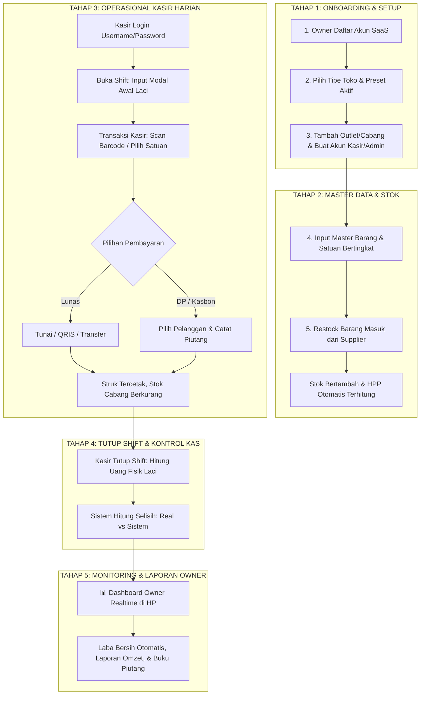

# 🌟 SDD 10: Rekomendasi Blueprint Logic & End-to-End Flow (Best Practice)

Dokumen ini adalah **panduan alur logika terlengkap** yang dirancang khusus agar sistem SaaS POS & Mini-ERP ini berjalan mulus, anti-bingung bagi kasir, anti-bocor bagi owner, dan super cepat dioperasikan.

---

## 1. Peta Alur Logika Keseluruhan (Master Flowchart)

---

## 2. Rincian Rekomendasi Logic per Tahapan

### 🔹 Tahap 1: Registrasi & Setup Toko (Owner)
* **Logic**:
  1. Owner mendaftar dengan *Nama Bisnis, Tipe Toko, Username & Password Owner*.
  2. Sistem otomatis menginisialisasi 1 Outlet default (*"Toko Utama"*) dan mengaktifkan modul sesuai tipe toko.
  3. Owner dapat membuat akun Kasir (misal username: `kasir_pagi`, password: `123`) dan mengaitkannya ke Outlet yang diinginkan.

---

### 🔹 Tahap 2: Master Barang & Stok Masuk (Restock)
* **Logic Multi-Satuan**:
  - Semua stok fisik di database disimpan dalam **Satuan Terkecil (`Base Unit`)**.
  - Contoh: Beli 2 Dus Pulpen (1 Dus = 120 Pcs) @ Rp 200.000/dus ➔ Database mencatat `+240 Pcs` dengan HPP Rp 1.666/pcs.
* **Logic Moving Average HPP**:
  - Setiap ada pembelian baru dari supplier dengan harga berbeda, HPP rata-rata ter-update otomatis tanpa pusing.

---

### 🔹 Tahap 3: Kasir POS (Fast, Accurate & Flexible)
* **Logic Barcode & Keranjang**:
  1. Kasir scan barcode ➔ Item masuk ke keranjang (+1 Qty).
  2. Jika barang punya multi-satuan, kasir bisa klik dropdown satuan (*Pcs / Dus / Sak*) ➔ Harga otomatis berubah.
* **Logic Pembayaran**:
  - **Lunas**: Kasir ketik uang tunai diterima ➔ Sistem hitung kembalian ➔ Transaksi status `PAID`.
  - **DP (Down Payment)**: Kasir pilih nama Pelanggan ➔ Masukkan nominal DP (misal DP Rp 200.000 dari total Rp 1.000.000) ➔ Status `PARTIAL`, sisa Rp 800.000 otomatis masuk ke Buku Piutang Pelanggan.
  - **Kasbon Penuh**: Kasir pilih nama Pelanggan ➔ Total belanja langsung masuk ke saldo hutang pelanggan.

---

### 🔹 Tahap 4: Tutup Shift Kasir (Pencegahan Kebocoran Kas / Fraud)
* **Logic Rekonsiliasi Kas Laci**:
  1. Kasir tidak diberitahu total uang tunai yang ada di sistem sebelum dia menghitung sendiri (*Blind Cash Count*).
  2. Kasir menghitung fisik uang di laci dan mengetikkan: misal Rp 1.250.000.
  3. Sistem membandingkan: $\text{Modal Awal} + \text{Penjualan Tunai} - \text{Kas Keluar} = \text{Rp } 1.250.000$.
  4. Jika ada selisih (kurang/lebih), otomatis tercatat di laporan audit untuk Owner.

---

### 🔹 Tahap 5: Manajemen Piutang & Cicilan (Buku Bon)
* **Logic Pelunasan**:
  - Pelanggan datang membayar hutang ➔ Admin/Kasir buka Buku Piutang ➔ Klik nama pelanggan ➔ Input nominal bayar ➔ Saldo piutang berkurang ➔ Kas masuk toko bertambah ➔ Cetak Kuitansi Bukti Bayar.

---

### 🔹 Tahap 6: Laporan Keuangan Otomatis (Tanpa Jurnal Akuntansi)
* **Rumus Otomatis**:
  $$\text{Laba Kotor} = \sum (\text{Harga Jual Item} - \text{HPP Item}) \times \text{Qty}$$
  $$\text{Laba Bersih} = \text{Laba Kotor} - \text{Pengeluaran Kas Operasional (Listrik, Gaji, dll)}$$
* Owner membuka dashboard dari HP kapan saja dan langsung melihat angka profit bersih tanpa perlu menyewa akuntan khusus!
