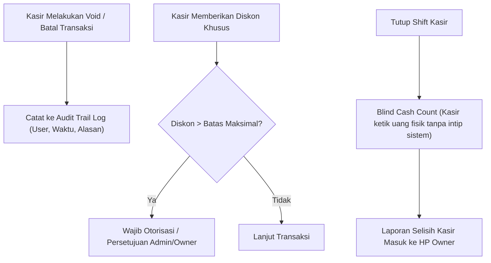

# 🛡️ SDD 11: Arsitektur Keamanan Sistem (Security) & Anti-Fraud

Dokumen ini mendefinisikan standar keamanan menyeluruh (*Defense-in-Depth*) untuk SaaS POS & Mini-ERP, mencakup keamanan data multi-tenant, proteksi otentikasi di Cloudflare Edge, dan pencegahan kecurangan kasir (*Anti-Fraud*).

---

## 1. 4 Lapisan Keamanan Utama (Defense-in-Depth)

```
┌─────────────────────────────────────────────────────────────────────────────┐
│ 1. CLOUDFLARE EDGE LAYER  │ DDoS Protection, WAF, Rate Limiting, TLS 1.3   │
├─────────────────────────────────────────────────────────────────────────────┤
│ 2. AUTH & SESSION LAYER   │ HTTP-Only Secure Cookies, JWT WebCrypto, Argon2 │
├─────────────────────────────────────────────────────────────────────────────┤
│ 3. APPLICATION & RBAC     │ Strict Tenant Isolation, Server-Side Guards     │
├─────────────────────────────────────────────────────────────────────────────┤
│ 4. POS ANTI-FRAUD LAYER   │ Blind Cash Count, Audit Trail Void/Diskon, Mask │
└─────────────────────────────────────────────────────────────────────────────┘
```

---

## 2. Rincian Lapisan Keamanan

### A. Isolasi Data Multi-Tenant (Anti Kebocoran Data Antar Toko)
* **Aturan Keras (`tenant_id` Guard)**:
  - Setiap query database wajib memfilter `where(eq(table.tenantId, session.tenantId))`.
  - Tidak ada satupun API endpoint publik yang menerima `tenant_id` dari client input (semua `tenant_id` diekstrak langsung dari session cookie yang terenkripsi dan terverifikasi di server).
* **Proteksi Parameter ID (IDOR Prevention)**:
  - User dari Toko A tidak akan pernah bisa mengakses ID transaksi, data pelanggan, atau produk milik Toko B meskipun mereka menebak ID URL-nya.

---

### B. Keamanan Otentikasi & Password di Edge
* **Hashing Standar Tinggi**: Password di-hash menggunakan **Argon2id / Scrypt / PBKDF2 WebCrypto** dengan salt unik per pengguna.
* **Stateless Session Cookie**:
  - `httpOnly: true` (kebal dari pencurian skrip XSS Javascript di browser).
  - `secure: true` (hanya dikirim via HTTPS).
  - `sameSite: 'strict'` (kebal dari serangan CSRF).
* **Proteksi Brute-Force Login**:
  - Rate limiting di edge: Maksimal 5x percobaan gagal per 5 menit per IP/Username sebelum dikunci sementara.

---

### C. Proteksi Anti-Fraud Meja Kasir (Pencegahan Kebocoran Kas)



1. **Blind Cash Reconciliation**: Kasir tidak dapat melihat saldo uang sistem sebelum dia selesai menghitung uang fisik di laci kasirnya.
2. **Audit Trail (Log Mutasi & Pembatalan)**:
   - Setiap penghapusan item di keranjang setelah dicetak (*Void*), perubahan stok manual, atau retur dicatat jejaknya (siapa yang melakukan, kapan, dan nominalnya).
3. **Penyembunyian HPP (HPP Masking)**:
   - Data modal barang (HPP) **dihapus dari response API kasir**. Kasir hanya menerima harga jual eceran/grosir, sehingga rahasia margin keuntungan toko tetap aman di tangan Owner.

---

### D. Keamanan Database & Injeksi (SQLi & XSS)
* **100% Parameterized Query**: Drizzle ORM menyusun query secara parameterized sehingga bebas dari celah SQL Injection.
* **Input Validation**: Validasi tipe data ketat di server menggunakan **Zod Schema**.
* **Cloudflare DDoS & SSL**: Semua traffic terenkripsi TLS 1.3 dan dilindungi oleh jaringan mitigasi DDoS Cloudflare secara gratis.
