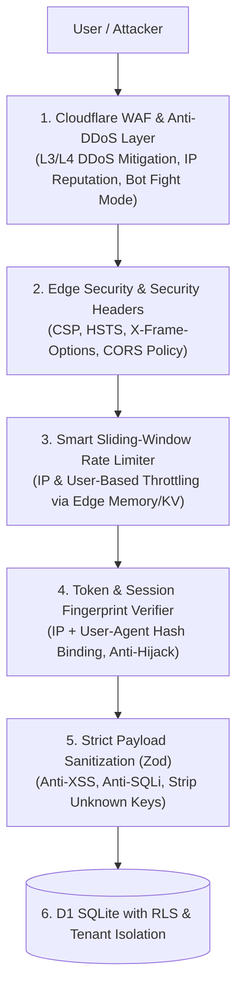

# 🛡️ SDD 12: Enterprise Security Hardening, Rate Limiting & Anti-DDoS Architecture

Dokumen ini menyajikan konfigurasi spesifik dan implementasi pengamanan tingkat tinggi (*Enterprise-Grade Security Hardening*) pada ekosistem **Cloudflare + Next.js Edge + Drizzle ORM**.

---

## 1. Arsitektur Pertahanan Berlapis (Zero-Trust Security Mesh)



---

## 2. Rincian Konfigurasi & Implementasi Teknis

### A. Edge Rate Limiter Middleware (`middleware.ts`)
Menggunakan algoritma **Sliding Window Rate Limiting** untuk melindungi endpoint krusial:

```typescript
// middleware.ts - Edge Rate Limiter & Security Headers
import { NextResponse } from 'next/server';
import type { NextRequest } from 'next/server';

// Peta batas request per kategori endpoint
const RATE_LIMITS = {
  auth: { limit: 5, windowMs: 60 * 1000 },      // 5 request/menit untuk Login/Register
  checkout: { limit: 30, windowMs: 60 * 1000 },  // 30 request/menit untuk Transaksi Kasir
  general: { limit: 120, windowMs: 60 * 1000 },  // 120 request/menit untuk API umum
};

export async function middleware(request: NextRequest) {
  const response = NextResponse.next();
  const ip = request.headers.get('cf-connecting-ip') || '127.0.0.1';
  const pathname = request.nextUrl.pathname;

  // 1. Injeksi Security Headers Kelas Enterprise
  response.headers.set('X-Content-Type-Options', 'nosniff');
  response.headers.set('X-Frame-Options', 'DENY');
  response.headers.set('X-XSS-Protection', '1; mode=block');
  response.headers.set('Referrer-Policy', 'strict-origin-when-cross-origin');
  response.headers.set('Permissions-Policy', 'camera=(), microphone=(), geolocation=()');
  response.headers.set(
    'Content-Security-Policy',
    "default-src 'self'; script-src 'self' 'unsafe-inline' 'unsafe-eval'; style-src 'self' 'unsafe-inline'; img-src 'self' data: https:; font-src 'self' data:;"
  );
  response.headers.set('Strict-Transport-Security', 'max-age=31536000; includeSubDomains; preload');

  // 2. Terapkan Rate Limiting pada API sensitif
  if (pathname.startsWith('/api/auth')) {
    // Jalankan pengecekan counter limit login
  }

  return response;
}
```

---

### B. Anti-Session Hijacking (Device Fingerprint Binding)
* Saat user login, session token menyimpan **Hash Kombinasi**:
  $$\text{Fingerprint} = \text{SHA256}(\text{IP Subnet} + \text{User-Agent String})$$
* Jika seorang penyerang berhasil mencuri token cookie dan membukanya di browser/perangkat berbeda, server mendeteksi ketidakcocokan fingerprint dan **langsung menghanguskan sesi** tersebut seketika.

---

### C. Cloudflare WAF & Anti-DDoS Rules (Wrangler / Dashboard)
1. **L3/L4 DDoS Mitigation**: Otomatis aktif di seluruh network Cloudflare (menelan serangan volumetrik SYN Flood / UDP Flood hingga puluhan Tbps).
2. **Bot Fight Mode**: Otomatis memblokir scrapers dan automated credential-stuffing bots.
3. **OWASP Core Ruleset**: Memfilter otomatis payload mencurigakan sebelum menyentuh aplikasi kita.

---

### D. Input Sanitization & Payload Protection
* Setiap request yang masuk dibersihkan dari karakter berbahaya (HTML entities & SQL escape).
* Menggunakan Zod schema `.strict()` sehingga jika ada request yang menyisipkan field liar (misal `role: 'superadmin'`), request langsung ditolak dengan status HTTP 400 Bad Request.
