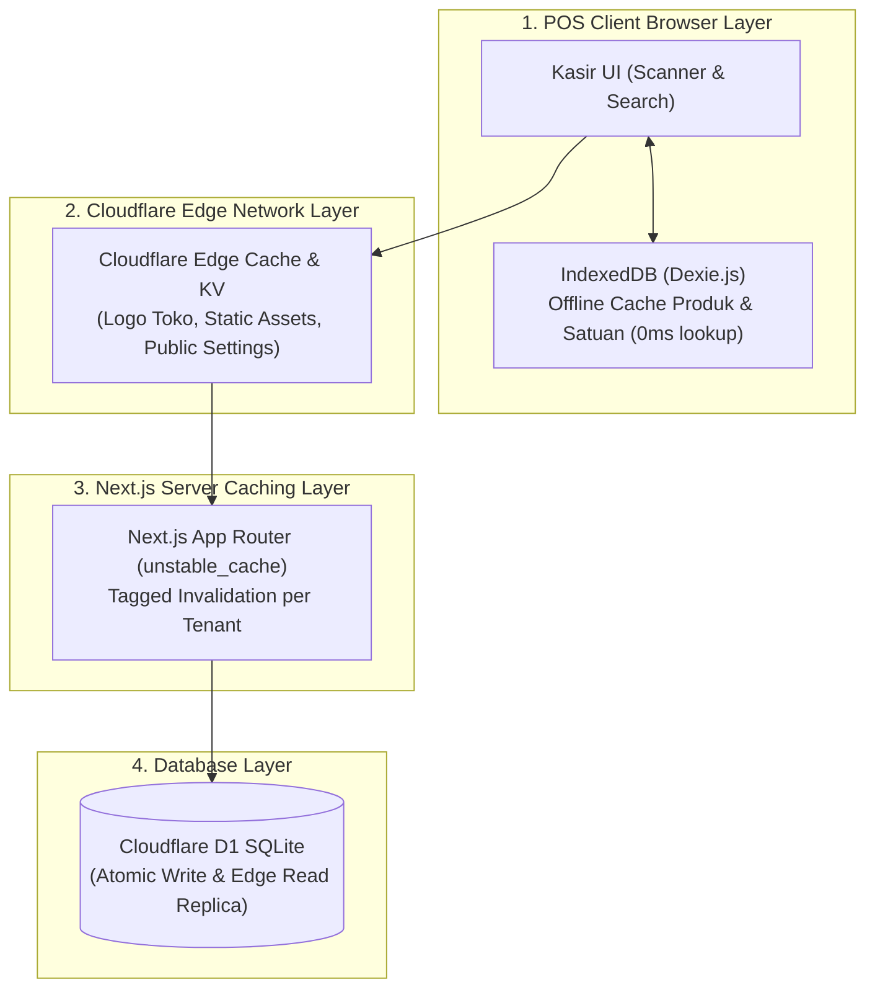

# ⚡ SDD 13: Arsitektur Caching & Offline-Resilience (Next.js + Edge + D1)

Dokumen ini mendefinisikan strategi caching 4 lapis (*Multi-Layered Caching Strategy*) untuk memastikan aplikasi kasir berkecepatan instan (sub-10ms), hemat konsumsi database, dan tahan terhadap gangguan koneksi internet.

---

## 1. 4 Lapis Arsitektur Caching



---

## 2. Rincian & Strategi Invalidation per Lapis

### A. Lapis 1: Client-Side Offline Cache (IndexedDB Kasir)
* **Tujuan**: Kasir scan barcode tidak boleh menunggu request internet (wajib **0 milidetik / Instan**).
* **Mekanisme**:
  - Saat kasir login/buka POS, seluruh katalog produk toko di-sync ke **IndexedDB lokal di browser kasir**.

## 3. PWA (Progressive Web App) & Offline Shell Architecture

Aplikasi ini dapat di-install langsung dari browser ke homescreen Android, iPad/iPhone, maupun Desktop Windows sebagai aplikasi native (*PWA Standalone*):

```
┌─────────────────────────────────────────────────────────────────────────────┐
│                       ARSITEKTUR PWA STANDALONE                             │
├─────────────────────────────────────────────────────────────────────────────┤
│ 1. Standalone Fullscreen Mode │ Tidak ada address bar browser yang mengganggu│
│ 2. Offline Asset Caching      │ Shell HTML, Icon & CSS di-cache Service Worker│
│ 3. IndexedDB Offline DB       │ Dexie.js menyimpan katalog produk di HP/Tab │
│ 4. Background Sync Queue      │ Transaksi offline disinkronkan saat online   │
└─────────────────────────────────────────────────────────────────────────────┘
```

1. **Manifest File (`src/app/manifest.ts`)**:
   - `display: "standalone"`
   - `theme_color: "#3182F6"`
   - `orientation: "any"` (Mendukung auto-rotate Portrait & Landscape instan).
2. **Pengalaman Kasir**:
   - Kasir membuka aplikasi layaknya aplikasi Android/iOS native tanpa perlu download dari Google Play Store / App Store!
   - Tetap bisa melakukan pencarian produk dan scan barcode meski internet toko tiba-tiba terputus.

  - Kasir mencari barang atau scan barcode langsung membaca dari IndexedDB lokal.
  - Jika internet kasir sempat down 30 detik, kasir tetap bisa melayani scan barang dan transaksi diantrikan di local queue (*Offline-Resilient*).

---

### B. Lapis 2: Next.js Server Cache Tags (`revalidateTag`)
* **Tujuan**: Mencegah query berulang ke database untuk data yang sering dibaca tapi jarang berubah (Katalog, Kategori, Profil Toko).
* **Mekanisme**:
  ```typescript
  // lib/cache/products.ts
  import { unstable_cache } from 'next/cache';
  import { db } from '@/lib/db';

  export const getCachedProducts = (tenantId: string) =>
    unstable_cache(
      async () => {
        return await db.query.products.findMany({
          where: (products, { eq }) => eq(products.tenantId, tenantId),
          with: { units: true, prices: true }
        });
      },
      [`products-${tenantId}`], // Cache Key
      {
        tags: [`products-${tenantId}`], // Invalidation Tag
        revalidate: 3600 // 1 Jam TTL
      }
    )();
  ```
* **Instant Invalidation**:
  - Saat Owner menambah/mengubah produk ➔ Server langsung memanggil:
    ```typescript
    revalidateTag(`products-${tenantId}`);
    ```
  - Cache Toko tersebut langsung bersih dan ter-refresh detik itu juga, tanpa mempengaruhi cache toko lain!

---

### C. Lapis 3: Database Write-Through (D1 SQLite)
* **Aturan Transaksi Finansial & Stok**:
  - Semua operasi penulisan (*Checkout Kasir, Bayar Piutang, Restock*) **TIDAK PERNAH DI-CACHE**.
  - Menggunakan **D1 Atomic Transactions** (`db.transaction()`) untuk menjamin konsistensi stok dan saldo kasir 100% akurat secara real-time.
