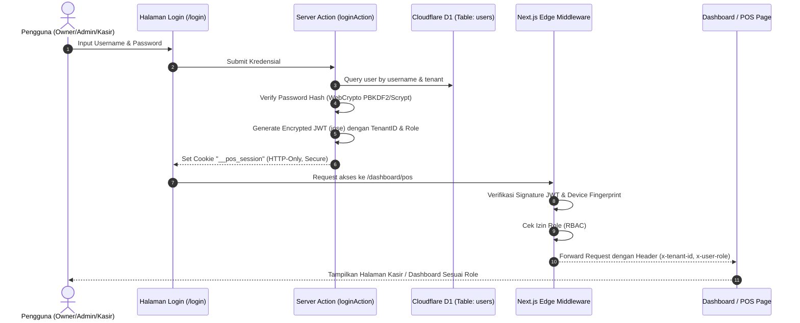

# 🔐 SDD 15: Arsitektur Auth, Middleware & Session Token di Edge (Cloudflare + Next.js)

Dokumen ini menjelaskan implementasi teknis sistem otentikasi stateless, struktur payload JWT, alur kerja Next.js Edge Middleware, dan mekanisme Role-Based Access Control (RBAC).

---

## 1. Arsitektur Otentikasi Stateless di Cloudflare Edge



---

## 2. Struktur Payload JWT Session Token (`jose`)

Menggunakan library `jose` (berbasis WebCrypto API standar, kompatibel 100% dengan Cloudflare Edge):

```typescript
// types/auth.ts
export interface JWTSessionPayload {
  userId: string;
  tenantId: string;
  tenantName: string;
  businessType: 'minimarket' | 'atk' | 'building' | 'hp' | 'general';
  username: string;
  role: 'owner' | 'admin' | 'cashier';
  assignedOutletId?: string; // ID Cabang penugasan kasir
  fingerprint: string; // Hash SHA-256 (IP Subnet + User-Agent)
  iat: number;
  exp: number; // 7 hari
}
```

---

## 3. Konfigurasi Cookie Sesi

```typescript
// lib/auth/cookies.ts
export const SESSION_COOKIE_NAME = '__pos_session';

export const SESSION_COOKIE_OPTIONS = {
  name: SESSION_COOKIE_NAME,
  httpOnly: true, // Mencegah akses Javascript di browser (Anti-XSS)
  secure: process.env.NODE_ENV === 'production', // Wajib HTTPS di production
  sameSite: 'lax' as const, // Mencegah CSRF
  path: '/',
  maxAge: 7 * 24 * 60 * 60, // 7 Hari
};
```

---

## 4. Logika Edge Middleware (`middleware.ts`)

```typescript
// middleware.ts
import { NextResponse } from 'next/server';
import type { NextRequest } from 'next/server';
import { verifySessionToken } from '@/lib/auth/jwt';

const PUBLIC_ROUTES = ['/', '/pricing', '/login', '/register'];

export async function middleware(request: NextRequest) {
  const { pathname } = request.nextUrl;
  const sessionCookie = request.cookies.get('__pos_session')?.value;

  // 1. Verifikasi Sesi
  const session = sessionCookie ? await verifySessionToken(sessionCookie) : null;

  // 2. Redirect jika sudah login tapi buka /login atau /register
  if (session && (pathname === '/login' || pathname === '/register')) {
    if (session.role === 'cashier') {
      return NextResponse.redirect(new URL('/dashboard/pos', request.url));
    }
    return NextResponse.redirect(new URL('/dashboard', request.url));
  }

  // 3. Proteksi Halaman Terlindungi (/dashboard/*)
  if (pathname.startsWith('/dashboard')) {
    if (!session) {
      const loginUrl = new URL('/login', request.url);
      loginUrl.searchParams.set('redirect', pathname);
      return NextResponse.redirect(loginUrl);
    }

    // 4. Role-Based Access Control (RBAC) di Middleware
    // Jika Kasir mencoba masuk ke menu sensitif Owner (Laporan, Settings, User Management)
    if (session.role === 'cashier') {
      const restrictedForCashier = ['/dashboard/reports', '/dashboard/settings', '/dashboard/users', '/dashboard/outlets'];
      const isRestricted = restrictedForCashier.some((route) => pathname.startsWith(route));

      if (isRestricted) {
        // Alihkan paksa kasir kembali ke layar POS
        return NextResponse.redirect(new URL('/dashboard/pos', request.url));
      }
    }

    // 5. Injeksi Context ke Downstream Header
    const requestHeaders = new Headers(request.headers);
    requestHeaders.set('x-tenant-id', session.tenantId);
    requestHeaders.set('x-user-id', session.userId);
    requestHeaders.set('x-user-role', session.role);

    return NextResponse.next({
      request: { headers: requestHeaders },
    });
  }

  return NextResponse.next();
}

export const config = {
  matcher: ['/((?!_next/static|_next/image|favicon.ico).*)'],
};
```

---

## 5. Helper `getCurrentSession()` di Server Actions & Pages

```typescript
// lib/auth/session.ts
import { cookies } from 'next/headers';
import { verifySessionToken } from './jwt';

export async function getCurrentSession() {
  const cookieStore = await cookies();
  const token = cookieStore.get('__pos_session')?.value;
  if (!token) return null;
  return await verifySessionToken(token);
}
```
* **Kelebihan**: Server Actions dapat langsung mengetahui `tenantId` dan `role` secara instan **tanpa perlu query ulang ke database**, membuat response aplikasi kasir secepat kilat!
