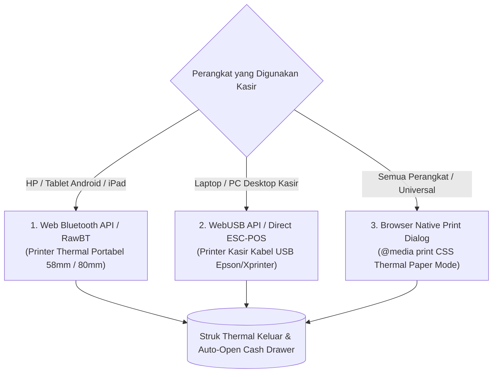

# 🖨️ SDD 19: Integrasi Hardware Printer Thermal (Bluetooth, USB & Browser Print)

Dokumen ini menjelaskan arsitektur integrasi printer thermal multi-koneksi agar kasir dapat mencetak struk belanja dengan lancar di berbagai perangkat (*Smartphone, Tablet Android/iPad, Laptop, maupun PC Desktop Kasir*).

---

## 1. 3 Jalur Koneksi Printer Thermal Universal



---

## 2. Rincian Teknis Implementasi

### A. Jalur 1: Bluetooth Thermal Printer (Untuk HP & Tablet)
* **Teknologi**: **Web Bluetooth API** (`navigator.bluetooth`) standar modern browser (Chrome / Edge / Opera).
* **Alur Penggunaan Kasir**:
  1. Kasir menyalakan Bluetooth di HP/Tablet dan menyalakan Printer Thermal (misal printer portable 58mm seharga 150rb-an seperti Panda, Eppos, Iware, Zijiang).
  2. Di layar kasir, klik tombol **"Hubungkan Bluetooth"** ➔ Pilih nama printer (misal `RPP02N` / `MTP-II`).
  3. Sekali terhubung, browser menyimpan device ID di `localStorage`.
  4. Setiap transaksi selesai ➔ Data biner perintah **ESC/POS** dikirimkan via Bluetooth Service Characteristic (`000018f0` / `0000ff00`) ➔ Struk langsung tercetak seketika tanpa popup dialog!

---

### B. Jalur 2: Kabel USB Thermal Printer (Untuk Laptop & PC Kasir)
* **Teknologi**: **WebUSB API** (`navigator.usb`) dan **ESC/POS Command Streamer**.
* **Dukungan Merek**: Xprinter, Epson TM-T82, Kassen, Iware, Matrix Point, dll.
* **Fitur Tambahan**:
  - **Auto Cut Paper**: Mengirim byte pemotong kertas otomatis (`\x1d\x56\x41\x00`).
  - **Kick Cash Drawer**: Mengirim pulsa biner (`\x1b\x70\x00\x19\xfa`) untuk membuka laci kasir otomatis saat struk dicetak!

---

### C. Jalur 3: Universal Browser Print Fallback (`@media print`)
* **Teknologi**: Standar cetak bawaan browser dengan layout CSS khusus thermal:
  ```css
  @media print {
    @page {
      margin: 0;
      size: 58mm auto; /* atau 80mm auto */
    }
    body {
      width: 58mm;
      padding: 2mm;
      font-family: monospace;
      font-size: 11px;
    }
  }
  ```
* **Kelebihan**: Berfungsi 100% di perangkat dan browser apapun tanpa butuh izin hardware khusus!

---

## 3. Komponen Pengaturan Printer di POS Kasir

Di menu pengaturan kasir (`/dashboard/settings`), kasir dapat memilih:
1. **Tipe Koneksi**: `[ Bluetooth ]` | `[ USB Kabel ]` | `[ Cetak Biasa (Browser) ]`.
2. **Lebar Kertas**: `[ 58 mm (Mini) ]` | `[ 80 mm (Standar Toko) ]`.
3. **Buka Laci Kasir Otomatis**: `[x] Aktifkan Sinyal Cash Drawer`.
4. **Tombol "Test Print"**: Untuk menguji hasil cetak teks, garis, dan logo sebelum toko mulai melayani pembeli.
