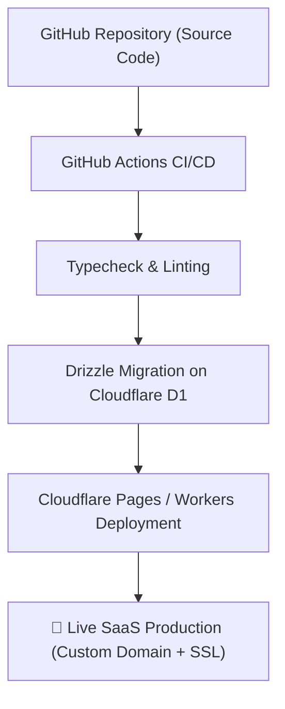

# 🚀 SDD 20: Panduan Deployment Cloudflare, Konfigurasi D1 & CI/CD Pipeline

Dokumen ini adalah panduan operasional langkah-demi-langkah (*Runbook*) untuk men-deploy aplikasi SaaS ke jaringan **Cloudflare Pages / Workers** menggunakan **Cloudflare D1 Database** dan **Wrangler CLI**.

---

## 1. Topologi Deployment di Cloudflare



---

## 2. File Konfigurasi Wrangler (`wrangler.toml`)

```toml
name = "miegraine-pos"
compatibility_date = "2026-08-29"
compatibility_flags = ["nodejs_compat"]
pages_build_output_dir = ".vercel/output/static"

# Cloudflare D1 Serverless SQLite Database Binding
[[d1_databases]]
binding = "DB"
database_name = "miegraine_production"
database_id = "your-d1-database-uuid-here"

# Cloudflare KV Storage Binding (Session & Cache)
[[kv_namespaces]]
binding = "CACHE_KV"
id = "your-kv-namespace-uuid-here"

# Environment Variables
[vars]
ENVIRONMENT = "production"
APP_URL = "https://pos.domainanda.com"
```

---

## 3. Langkah Inisialisasi Database D1 & Migrasi Drizzle

### Step 1: Login & Buat Database D1 di Cloudflare
```bash
# Login ke akun Cloudflare
npx wrangler login

# Buat database serverless D1 baru
npx wrangler d1 create miegraine_production
```

### Step 2: Konfigurasi Drizzle ORM (`drizzle.config.ts`)
```typescript
import { defineConfig } from 'drizzle-kit';

export default defineConfig({
  schema: './src/lib/db/schema/*',
  out: './drizzle/migrations',
  dialect: 'sqlite',
  driver: 'd1-http',
  dbCredentials: {
    accountId: process.env.CLOUDFLARE_ACCOUNT_ID!,
    databaseId: process.env.CLOUDFLARE_DATABASE_ID!,
    token: process.env.CLOUDFLARE_D1_TOKEN!,
  },
});
```

### Step 3: Eksekusi Migrasi Skema ke D1
```bash
# Generate migrasi SQL lokal
npx drizzle-kit generate

# Terapkan migrasi ke database D1 di Cloudflare (Remote)
npx wrangler d1 migrations apply miegraine_production --remote
```

---

## 4. Perintah Build & Deploy ke Cloudflare Pages

```bash
# 1. Build aplikasi Next.js untuk Cloudflare Pages
npm run build

# 2. Deploy instan menggunakan Wrangler
npx wrangler pages deploy .vercel/output/static --project-name=miegraine-pos
```

Setelah perintah ini selesai, aplikasi SaaS langsung live di edge server global Cloudflare dengan kecepatan akses instan dari seluruh Indonesia!
