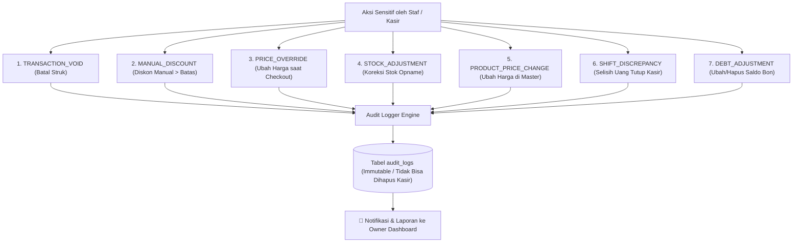

# 🕵️ SDD 21: Modul Audit Log & Activity Tracking (Anti-Fraud & Forensik Toko)

Dokumen ini menjelaskan sistem pencatatan jejak aktivitas (*Audit Trail*) untuk menjamin transparansi, akuntabilitas, dan keamanan operasional dari potensi kecurangan internal (*Internal Fraud*).

---

## 1. Mengapa Audit Log Sangat Krusial di POS Ritel?

Dalam operasional toko sehari-hari, modus kecurangan kasir/staf yang paling sering terjadi adalah:
1. **Void Fraud (Pembatalan Struk Fiktif)**: Pembeli membayar tunai dan pergi tanpa struk ➔ Kasir membatalkan transaksi di sistem ➔ Kasir mengantongi uang tunai pembeli.
2. **Manipulasi Stok & HPP**: Staf gudang/admin mengubah stok barang tanpa izin untuk menutupi barang hilang.
3. **Diskon & Tawar Menawar Fiktif**: Kasir memberikan diskon besar ke teman tanpa izin Owner.
4. **Manipulasi Buku Piutang**: Mengubah atau menghapus saldo hutang pelanggan tanpa ada uang kas masuk.

Dengan **Audit Log**, seluruh aksi sensitif tercatat permanen: **Siapa pelakunya, jam berapa, apa yang diubah (sebelum vs sesudah), dan apa alasannya**.

---

## 2. 7 Event Kritis yang Wajib Dicatat (Event Triggers)



---

## 3. Skema Database Drizzle (D1 SQLite)

```typescript
// schema/audit.ts
import { sqliteTable, text, integer } from 'drizzle-orm/sqlite-core';
import { tenants, users } from './auth';

export const auditLogs = sqliteTable('audit_logs', {
  id: text('id').primaryKey(),
  tenantId: text('tenant_id').notNull().references(() => tenants.id, { onDelete: 'cascade' }),
  userId: text('user_id').notNull().references(() => users.id),
  userName: text('user_name').notNull(),
  userRole: text('user_role').notNull(), // 'owner' | 'admin' | 'cashier'
  outletId: text('outlet_id'),
  action: text('action').notNull(), // 'TRANSACTION_VOID', 'STOCK_ADJUSTMENT', dll.
  resourceType: text('resource_type').notNull(), // 'TRANSACTION', 'PRODUCT', 'CUSTOMER_DEBT', 'SHIFT'
  resourceId: text('resource_id'),
  oldData: text('old_data'), // JSON string: kondisi sebelum diubah
  newData: text('new_data'), // JSON string: kondisi setelah diubah
  reason: text('reason'), // Alasan yang wajib diketik user (misal: "Salah scan barcode")
  ipAddress: text('ip_address'),
  createdAt: integer('created_at', { mode: 'timestamp' }).$defaultFn(() => new Date()),
});
```

---

## 4. Tampilan Halaman Audit Log di Dashboard Owner (`/dashboard/audit`)

* **Filter Cepat**: Berdasarkan Toko Cabang, Nama Karyawan, Jenis Aksi (*Void, Diskon, Stok, Piutang*), dan Rentang Tanggal.
* **Tampilan Log Transparan**:
  ```
  [ 29/08/2026 14:10 ] Kasir 'Siti' membatalkan Struk #INV-0089 (Total: Rp 85.000)
                       Alasan: "Pembeli batal beli semen karena salah ukuran"
                       Cabang: Toko Cabang Utama

  [ 29/08/2026 11:30 ] Admin 'Budi' mengubah Stok 'Cat Avian 1Kg' dari [ 15 Pcs ] -> [ 10 Pcs ]
                       Alasan: "5 kaleng pecah saat bongkar muat"
                       Cabang: Gudang Pusat
  ```
* **Hak Akses**: Halaman ini **HANYA BISA DIBUKA OLEH OWNER**, staf admin dan kasir tidak memiliki izin untuk melihat atau menghapus log ini (*Immutable Audit Trail*).
