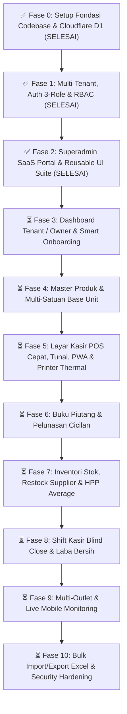

# 🗺️ SDD 22: Master Development Roadmap (Phased Execution Plan)

Dokumen ini mendefinisikan peta jalan (*Roadmap*) eksekusi pembangunan aplikasi secara bertahap dari Fase 0 hingga Fase 10. **Seluruh fase fondasi, arsitektur multi-tenant, portal superadmin, dan suite UI/UX telah diimplementasikan secara terstruktur.**

---

## 📌 Peta Status Roadmap Pembangunan

---

## 📋 Rincian Langkah, Dokumen Rujukan & Status Lengkap Seluruh Fase

| Fase | Nama Fase & Ruang Lingkup | Dokumen SDD Rujukan Wajib | Status |
| :---: | :--- | :--- | :---: |
| **0** | **Setup Fondasi Codebase & Cloudflare D1** - Inisialisasi Next.js 15 App Router, TypeScript, Tailwind CSS - Driver LibSQL/SQLite D1 & Drizzle Config - Token Desain Toss FinTech (`#3182F6`) & Tabular Numerals - Optimasi Turbopack (`--turbo`) & Tree-Shaking `optimizePackageImports` | [`00`](./00-overview-architecture.md), [`17`](./17-panduan-ui-ux-dan-design-system.md), [`20`](./20-panduan-deployment-cloudflare-dan-cicd.md), [`23`](./23-master-skema-database-d1-drizzle.md) | **SELESAI ✅** |
| **1** | **Multi-Tenancy, Auth JWT Edge & RBAC Middleware** - Tabel `tenants`, `users` (3 role: Owner, Admin, Kasir) + Superadmin, `outlets` - WebCrypto Password Hashing & Stateless JWT `jose` - Next.js Edge Middleware RBAC Guard & Tenant Context Injection - PWA Metadata Manifest Dinamis (`manifest.ts`) | [`01`](./01-modul-auth-tenant.md), [`08`](./08-cakupan-jenis-toko.md), [`09`](./09-onboarding-preset-dan-smart-toggle.md), [`15`](./15-arsitektur-auth-middleware-session-token.md), [`24`](./24-master-peta-rute-dan-url-aplikasi.md) | **SELESAI ✅** |
| **2** | **Superadmin SaaS Portal & Reusable UI Suite** - Reusable Suite: `Modal` & `ConfirmModal` (Portal Full-Screen `document.body`), `ToastProvider` (Adaptive 1-line/2-line + Solid 3.5px Timeout Bar), `Pagination` (Icon-only), `DataTable`, `StatCard`, `Skeleton` - Page Transitions (`template.tsx`) & Streaming SSR Skeletons (`loading.tsx`) - Dashboard Superadmin (`/superadmin`): Overview, Tenants (Impersonasi 1-Klik), Billing, Audit Logs, Settings (Full-Width + Independent Save) | [`16`](./16-modul-superadmin-saas-platform.md), [`17`](./17-panduan-ui-ux-dan-design-system.md), [`21`](./21-modul-audit-log-dan-activity-tracking.md), [`24`](./24-master-peta-rute-dan-url-aplikasi.md) | **SELESAI ✅** |
| **3** | **Dashboard Tenant / Owner & Smart Onboarding** - Smart Onboarding Wizard 6 Tipe Ritel Indonesia - Ringkasan Omzet, Margin, dan Arus Kas Harian - Smart Toggle Fitur Sesuai Model Bisnis Ritel | [`09`](./09-onboarding-preset-dan-smart-toggle.md), [`14`](./14-struktur-web-portal-landing-login-dashboard.md), [`17`](./17-panduan-ui-ux-dan-design-system.md) | **SIAP DIEKSEKUSI ⏳** |
| **4** | **Master Produk, Multi-Satuan Bertingkat & Base Unit** - CRUD Kategori & Master Produk (`/dashboard/products`) - Konversi Satuan Bertingkat (Aturan Emas: Stok di Base Unit) - Tier Harga Eceran vs Grosir & IMEI/Serial Number Handphone | [`02`](./02-modul-master-produk.md), [`08`](./08-cakupan-jenis-toko.md), [`23`](./23-master-skema-database-d1-drizzle.md) | **SIAP DIEKSEKUSI ⏳** |
| **5** | **Layar Kasir POS Cepat, Tunai, PWA & Printer** - Responsive POS (Floating Cart Mobile & Split 2-Kolom Desktop) - Dropdown Ganti Satuan Realtime & Shortcut `F2` / `Enter` - Modal Pembayaran Tunai Cepat (Uang Pas & Auto Kembalian) - Web Bluetooth, WebUSB & Browser Print ESC/POS 58mm/80mm - IndexedDB Dexie.js Caching 0ms Barcode Scan & Offline Mode | [`03`](./03-modul-kasir-pos.md), [`13`](./13-arsitektur-caching-dan-offline-resilience.md), [`19`](./19-integrasi-hardware-printer-thermal-bluetooth-usb.md) | **SIAP DIEKSEKUSI ⏳** |
| **6** | **Buku Piutang (Bon), Pelunasan Cicilan & Struk WA** - Master Pelanggan, Batas Kredit & Saldo Hutang Aktif (`/dashboard/debts`) - Transaksi Kasir Mode DP / Kasbon Penuh - Modal Pelunasan/Cicilan Piutang 1-Klik (`debt_payments`) - Generator Kirim Tagihan Saldo Bon Digital via WhatsApp | [`04`](./04-modul-piutang-kasbon.md), [`18`](./18-fitur-pelengkap-export-excel-wa-dan-backup.md) | **SIAP DIEKSEKUSI ⏳** |
| **7** | **Inventori Stok, Restock Supplier, HPP & Mutasi** - Manajemen Supplier & Faktur Pembelian PO (`/dashboard/inventory/restock`) - Penerimaan Barang Masuk + Auto Update HPP Moving Average - Stok Opname Fisik vs Sistem (`/dashboard/inventory/opname`) & Rekap Alasan Selisih - Kartu Mutasi Stok Realtime & Peringatan Stok Menipis (*Low Stock Alert*) | [`05`](./05-modul-inventori-stok.md), [`07`](./07-modul-multi-outlet-monitoring.md), [`23`](./23-master-skema-database-d1-drizzle.md) | **SIAP DIEKSEKUSI ⏳** |
| **8** | **Shift Kasir Blind Count & Laba Bersih** - Buka Shift (Modal Laci) & Tutup Shift Blind Cash Count di POS - Rekonsiliasi Kas Laci & Deteksi Selisih Kasir Realtime - Dashboard Laba Bersih Realtime (`/dashboard/reports`): Omzet - HPP - Beban Toko - Modal Pencatatan Beban Operasional Kas Keluar (*Expense Modal*) & Top Produk Terlaris | [`06`](./06-modul-laporan-keuangan.md), [`11`](./11-arsitektur-security-dan-anti-fraud.md), [`23`](./23-master-skema-database-d1-drizzle.md) | **SIAP DIEKSEKUSI ⏳** |
| **9** | **Multi-Outlet & Live Mobile Monitoring** - Manajemen Multi-Cabang & Gudang - Transfer Stok Antar Toko dengan Status Approval - Live Monitoring Laporan Konsolidasi via Smartphone Owner | [`07`](./07-modul-multi-outlet-monitoring.md), [`17`](./17-panduan-ui-ux-dan-design-system.md) | **SIAP DIEKSEKUSI ⏳** |
| **10**| **Bulk Import/Export Excel & Security Hardening** - Upload Template Excel & Smart Preview Validation Screen - Generator Label Barcode / Rak Produk - Dokumen Resmi Faktur Penjualan & Surat Jalan A4/A5 PDF - Enterprise Security Headers & Rate Limiting Hardening | [`12`](./12-security-hardening-dan-rate-limiting.md), [`18`](./18-fitur-pelengkap-export-excel-wa-dan-backup.md), [`20`](./20-panduan-deployment-cloudflare-dan-cicd.md) | **SIAP DIEKSEKUSI ⏳** |

---
> Dikelola dan didokumentasikan oleh **Jule (주리)** untuk **Bos Besar Banget**. ✨
