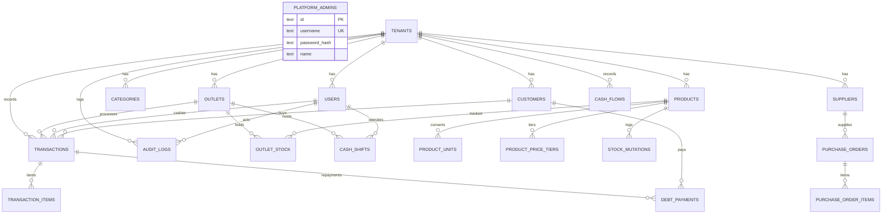

# 🗄️ SDD 23: Master Skema Database Drizzle ORM (Cloudflare D1 SQLite)

Dokumen ini adalah **Single Source of Truth** untuk seluruh struktur tabel database, tipe data, foreign key, index, dan constraint yang digunakan dalam sistem.

---

## 1. Diagram Relasi Entitas Global (Complete ERD)



---

## 2. Definisi Skema Drizzle TypeScript Lengkap (`src/lib/db/schema.ts`)

```typescript
import { sqliteTable, text, integer, real, index, uniqueIndex } from 'drizzle-orm/sqlite-core';

// ==========================================
// 1. SUPERADMIN & PLATFORM LEVEL
// ==========================================
export const platformAdmins = sqliteTable('platform_admins', {
  id: text('id').primaryKey(),
  username: text('username').notNull().unique(),
  passwordHash: text('password_hash').notNull(),
  name: text('name').notNull(),
  role: text('role').default('superadmin').notNull(),
  createdAt: integer('created_at', { mode: 'timestamp' }).$defaultFn(() => new Date()),
});

// ==========================================
// 2. TENANTS & USER MANAGEMENT (RBAC)
// ==========================================
export const tenants = sqliteTable('tenants', {
  id: text('id').primaryKey(), // cuid2 / nanoid
  name: text('name').notNull(),
  businessType: text('business_type').notNull(), // 'minimarket' | 'atk' | 'building' | 'gadget' | 'general'
  phone: text('phone'),
  address: text('address'),
  receiptHeader: text('receipt_header'),
  receiptFooter: text('receipt_footer').default('Terima kasih telah berbelanja'),
  subscriptionStatus: text('subscription_status').default('trial').notNull(), // 'trial' | 'active' | 'expired'
  trialEndsAt: integer('trial_ends_at', { mode: 'timestamp' }),
  createdAt: integer('created_at', { mode: 'timestamp' }).$defaultFn(() => new Date()),
});

export const outlets = sqliteTable('outlets', {
  id: text('id').primaryKey(),
  tenantId: text('tenant_id').notNull().references(() => tenants.id, { onDelete: 'cascade' }),
  name: text('name').notNull(), // 'Toko Utama', 'Cabang Pasar', 'Gudang'
  address: text('address'),
  phone: text('phone'),
  isMain: integer('is_main', { mode: 'boolean' }).default(false).notNull(),
  createdAt: integer('created_at', { mode: 'timestamp' }).$defaultFn(() => new Date()),
}, (table) => ({
  tenantIdx: index('outlet_tenant_idx').on(table.tenantId),
}));

export const users = sqliteTable('users', {
  id: text('id').primaryKey(),
  tenantId: text('tenant_id').notNull().references(() => tenants.id, { onDelete: 'cascade' }),
  outletId: text('outlet_id').references(() => outlets.id),
  name: text('name').notNull(),
  username: text('username').notNull(),
  passwordHash: text('password_hash').notNull(),
  role: text('role', { enum: ['owner', 'admin', 'cashier'] }).default('cashier').notNull(),
  isActive: integer('is_active', { mode: 'boolean' }).default(true).notNull(),
  createdAt: integer('created_at', { mode: 'timestamp' }).$defaultFn(() => new Date()),
}, (table) => ({
  tenantUsernameIdx: uniqueIndex('user_tenant_username_idx').on(table.tenantId, table.username),
}));

// ==========================================
// 3. MASTER PRODUK, MULTI-SATUAN & HARGA
// ==========================================
export const categories = sqliteTable('categories', {
  id: text('id').primaryKey(),
  tenantId: text('tenant_id').notNull().references(() => tenants.id, { onDelete: 'cascade' }),
  name: text('name').notNull(),
});

export const products = sqliteTable('products', {
  id: text('id').primaryKey(),
  tenantId: text('tenant_id').notNull().references(() => tenants.id, { onDelete: 'cascade' }),
  categoryId: text('category_id').references(() => categories.id),
  name: text('name').notNull(),
  barcode: text('barcode'),
  baseUnit: text('base_unit').default('pcs').notNull(), // 'pcs', 'kg', 'meter', 'lembar'
  costPrice: real('cost_price').default(0).notNull(), // HPP per base unit
  hasImei: integer('has_imei', { mode: 'boolean' }).default(false).notNull(),
  minStockAlert: real('min_stock_alert').default(5),
  isActive: integer('is_active', { mode: 'boolean' }).default(true).notNull(),
  createdAt: integer('created_at', { mode: 'timestamp' }).$defaultFn(() => new Date()),
}, (table) => ({
  tenantBarcodeIdx: index('product_tenant_barcode_idx').on(table.tenantId, table.barcode),
}));

export const productUnits = sqliteTable('product_units', {
  id: text('id').primaryKey(),
  tenantId: text('tenant_id').notNull().references(() => tenants.id, { onDelete: 'cascade' }),
  productId: text('product_id').notNull().references(() => products.id, { onDelete: 'cascade' }),
  unitName: text('unit_name').notNull(), // 'dus', 'sak', 'pack', 'rol'
  conversionQty: real('conversion_qty').notNull(), // e.g., 1 dus = 24 base unit
  barcode: text('barcode'),
});

export const productPriceTiers = sqliteTable('product_price_tiers', {
  id: text('id').primaryKey(),
  tenantId: text('tenant_id').notNull().references(() => tenants.id, { onDelete: 'cascade' }),
  productId: text('product_id').notNull().references(() => products.id, { onDelete: 'cascade' }),
  productUnitId: text('product_unit_id').references(() => productUnits.id, { onDelete: 'cascade' }),
  tierName: text('tier_name').default('ecer').notNull(), // 'ecer' | 'grosir' | 'langganan'
  minQty: real('min_qty').default(1).notNull(),
  price: real('price').notNull(),
});

export const outletStock = sqliteTable('outlet_stock', {
  id: text('id').primaryKey(),
  tenantId: text('tenant_id').notNull().references(() => tenants.id, { onDelete: 'cascade' }),
  outletId: text('outlet_id').notNull().references(() => outlets.id, { onDelete: 'cascade' }),
  productId: text('product_id').notNull().references(() => products.id, { onDelete: 'cascade' }),
  currentStock: real('current_stock').default(0).notNull(), // stored in Base Unit
}, (table) => ({
  outletProductIdx: uniqueIndex('outlet_product_unique_idx').on(table.outletId, table.productId),
}));

// ==========================================
// 4. TRANSAKSI POS & PIUTANG PELANGGAN
// ==========================================
export const customers = sqliteTable('customers', {
  id: text('id').primaryKey(),
  tenantId: text('tenant_id').notNull().references(() => tenants.id, { onDelete: 'cascade' }),
  name: text('name').notNull(),
  phone: text('phone'),
  address: text('address'),
  debtLimit: real('debt_limit').default(0).notNull(),
  currentDebt: real('current_debt').default(0).notNull(),
  createdAt: integer('created_at', { mode: 'timestamp' }).$defaultFn(() => new Date()),
});

export const transactions = sqliteTable('transactions', {
  id: text('id').primaryKey(),
  tenantId: text('tenant_id').notNull().references(() => tenants.id, { onDelete: 'cascade' }),
  outletId: text('outlet_id').notNull().references(() => outlets.id),
  userId: text('user_id').notNull().references(() => users.id),
  customerId: text('customer_id').references(() => customers.id),
  invoiceNo: text('invoice_no').notNull(),
  subtotal: real('subtotal').notNull(),
  discount: real('discount').default(0).notNull(),
  total: real('total').notNull(),
  paidAmount: real('paid_amount').notNull(),
  changeAmount: real('change_amount').default(0).notNull(),
  remainingDebt: real('remaining_debt').default(0).notNull(),
  paymentMethod: text('payment_method').default('CASH').notNull(), // 'CASH' | 'QRIS' | 'TRANSFER' | 'DEBT' | 'DP'
  paymentStatus: text('payment_status').default('PAID').notNull(), // 'PAID' | 'PARTIAL' | 'UNPAID'
  notes: text('notes'),
  createdAt: integer('created_at', { mode: 'timestamp' }).$defaultFn(() => new Date()),
}, (table) => ({
  tenantInvoiceIdx: uniqueIndex('transaction_tenant_invoice_idx').on(table.tenantId, table.invoiceNo),
}));

export const transactionItems = sqliteTable('transaction_items', {
  id: text('id').primaryKey(),
  transactionId: text('transaction_id').notNull().references(() => transactions.id, { onDelete: 'cascade' }),
  productId: text('product_id').notNull().references(() => products.id),
  unitName: text('unit_name').notNull(),
  conversionQty: real('conversion_qty').default(1).notNull(),
  qty: real('qty').notNull(),
  pricePerUnit: real('price_per_unit').notNull(),
  costPrice: real('cost_price').notNull(), // snapshot HPP saat transaksi
  subtotal: real('subtotal').notNull(),
  imeiList: text('imei_list'), // Serial/IMEI opsional
});

export const debtPayments = sqliteTable('debt_payments', {
  id: text('id').primaryKey(),
  tenantId: text('tenant_id').notNull().references(() => tenants.id, { onDelete: 'cascade' }),
  outletId: text('outlet_id').notNull().references(() => outlets.id),
  customerId: text('customer_id').notNull().references(() => customers.id),
  userId: text('user_id').notNull().references(() => users.id),
  amount: real('amount').notNull(),
  paymentMethod: text('payment_method').default('CASH').notNull(),
  notes: text('notes'),
  createdAt: integer('created_at', { mode: 'timestamp' }).$defaultFn(() => new Date()),
});

// ==========================================
// 5. SUPPLIERS, RESTOCK & MUTASI STOK
// ==========================================
export const suppliers = sqliteTable('suppliers', {
  id: text('id').primaryKey(),
  tenantId: text('tenant_id').notNull().references(() => tenants.id, { onDelete: 'cascade' }),
  name: text('name').notNull(),
  phone: text('phone'),
  address: text('address'),
});

export const purchaseOrders = sqliteTable('purchase_orders', {
  id: text('id').primaryKey(),
  tenantId: text('tenant_id').notNull().references(() => tenants.id, { onDelete: 'cascade' }),
  outletId: text('outlet_id').notNull().references(() => outlets.id),
  supplierId: text('supplier_id').references(() => suppliers.id),
  poNumber: text('po_number').notNull(),
  totalAmount: real('total_amount').notNull(),
  status: text('status').default('COMPLETED').notNull(), // 'DRAFT' | 'COMPLETED'
  receivedAt: integer('received_at', { mode: 'timestamp' }).$defaultFn(() => new Date()),
});

export const purchaseOrderItems = sqliteTable('purchase_order_items', {
  id: text('id').primaryKey(),
  purchaseOrderId: text('purchase_order_id').notNull().references(() => purchaseOrders.id, { onDelete: 'cascade' }),
  productId: text('product_id').notNull().references(() => products.id),
  unitName: text('unit_name').notNull(),
  conversionQty: real('conversion_qty').default(1).notNull(),
  qty: real('qty').notNull(),
  purchasePrice: real('purchase_price').notNull(),
  subtotal: real('subtotal').notNull(),
});

export const stockMutations = sqliteTable('stock_mutations', {
  id: text('id').primaryKey(),
  tenantId: text('tenant_id').notNull().references(() => tenants.id, { onDelete: 'cascade' }),
  outletId: text('outlet_id').notNull().references(() => outlets.id),
  productId: text('product_id').notNull().references(() => products.id),
  type: text('type').notNull(), // 'SALE' | 'PURCHASE' | 'TRANSFER_IN' | 'TRANSFER_OUT' | 'ADJUSTMENT'
  qtyChange: real('qty_change').notNull(), // base unit (+/-)
  stockBefore: real('stock_before').notNull(),
  stockAfter: real('stock_after').notNull(),
  referenceId: text('reference_id'),
  notes: text('notes'),
  createdAt: integer('created_at', { mode: 'timestamp' }).$defaultFn(() => new Date()),
});

// ==========================================
// 6. SHIFT KASIR & ARUS KAS KEUANGAN
// ==========================================
export const cashShifts = sqliteTable('cash_shifts', {
  id: text('id').primaryKey(),
  tenantId: text('tenant_id').notNull().references(() => tenants.id, { onDelete: 'cascade' }),
  outletId: text('outlet_id').notNull().references(() => outlets.id),
  userId: text('user_id').notNull().references(() => users.id),
  startingCash: real('starting_cash').notNull(), // Modal uang receh di laci
  expectedCash: real('expected_cash').default(0).notNull(), // Dihitung sistem
  actualCash: real('actual_cash'), // Diinput kasir saat tutup shift (Blind Count)
  discrepancy: real('discrepancy').default(0), // Selisih (actual - expected)
  status: text('status').default('OPEN').notNull(), // 'OPEN' | 'CLOSED'
  openedAt: integer('opened_at', { mode: 'timestamp' }).$defaultFn(() => new Date()),
  closedAt: integer('closed_at', { mode: 'timestamp' }),
});

export const cashFlows = sqliteTable('cash_flows', {
  id: text('id').primaryKey(),
  tenantId: text('tenant_id').notNull().references(() => tenants.id, { onDelete: 'cascade' }),
  outletId: text('outlet_id').notNull().references(() => outlets.id),
  type: text('type').notNull(), // 'IN' (Pemasukan lain) | 'OUT' (Biaya Operasional)
  category: text('category').notNull(), // 'LISTRIK', 'GAJI', 'SEWA', 'MAKAN', 'LAIN'
  amount: real('amount').notNull(),
  description: text('description'),
  createdAt: integer('created_at', { mode: 'timestamp' }).$defaultFn(() => new Date()),
});

// ==========================================
// 7. AUDIT LOG & AKTIVITAS SENSITIF
// ==========================================
export const auditLogs = sqliteTable('audit_logs', {
  id: text('id').primaryKey(),
  tenantId: text('tenant_id').notNull().references(() => tenants.id, { onDelete: 'cascade' }),
  outletId: text('outlet_id'),
  userId: text('user_id').notNull().references(() => users.id),
  userName: text('user_name').notNull(),
  userRole: text('user_role').notNull(),
  action: text('action').notNull(), // 'TRANSACTION_VOID', 'PRICE_OVERRIDE', 'STOCK_ADJUSTMENT'
  resourceType: text('resource_type').notNull(), // 'TRANSACTION', 'PRODUCT', 'CUSTOMER_DEBT'
  resourceId: text('resource_id'),
  oldData: text('old_data'),
  newData: text('new_data'),
  reason: text('reason'),
  ipAddress: text('ip_address'),
  createdAt: integer('created_at', { mode: 'timestamp' }).$defaultFn(() => new Date()),
});
