# 🗺️ SDD 24: Master Peta Rute URL, Halaman & Akses Kontrol (Routing Matrix)

Dokumen ini adalah **Master Routing Table** yang memetakan seluruh rute URL, jenis halaman, komponen Next.js App Router, proteksi middleware, dan matriks hak akses RBAC (Owner, Admin, Kasir, Superadmin).

---

## 1. Peta Rute URL Lengkap (Complete URL Directory)

```mermaid
graph TD
    Root["/ (Root URL)"] --> Public["Area Publik & Marketing"]
    Root --> Auth["Area Otentikasi (/login, /register)"]
    Root --> Dashboard["Area Dashboard & Kasir (/dashboard/*)"]
    Root --> Super["Area Superadmin Platform (/superadmin/*)"]

    Public --> Home["/ (Landing Page Miegraine)"]
    Public --> Pricing["/pricing (Paket Langganan SaaS)"]

    Auth --> Login["/login (Masuk Username & Password)"]
    Auth --> Register["/register (Smart Onboarding Toko)"]

    Dashboard --> POS["/dashboard/pos (Layar Kasir & Kiosk Mode)"]
    Dashboard --> Overview["/dashboard (Executive Overview & Metrik)"]
    Dashboard --> Products["/dashboard/products (Master Produk & Satuan)"]
    Dashboard --> Inventory["/dashboard/inventory (Stok, Restock & Opname)"]
    Dashboard --> Debts["/dashboard/debts (Buku Piutang Bon & Cicilan)"]
    Dashboard --> Reports["/dashboard/reports (Laba Bersih & Arus Kas)"]
    Dashboard --> Outlets["/dashboard/outlets (Cabang & Transfer Stok)"]
    Dashboard --> Users["/dashboard/users (Kelola Karyawan & Kasir)"]
    Dashboard --> Audit["/dashboard/audit (Jejak Log Anti-Fraud)"]
    Dashboard --> Settings["/dashboard/settings (Format Struk & Profil Toko)"]

    Super --> SAOverview["/superadmin (Ringkasan Bisnis & Global MRR)"]
    Super --> SATenants["/superadmin/tenants (Kelola Toko & Impersonasi 1-Klik)"]
    Super --> SABilling["/superadmin/billing (Tagihan, Invoice & Verifikasi Pembayaran)"]
    Super --> SAAudit["/superadmin/audit (Jejak Log Keamanan & Aktivitas Platform)"]
    Super --> SASettings["/superadmin/settings (Tarif, Kontak CS & Broadcast Banner)"]
```

---

## 2. Tabel Matriks Hak Akses Rute (RBAC Routing Matrix)

| URL Path | Nama Modul | Tipe Halaman | Superadmin | Owner (Pemilik) | Admin (Cabang) | Kasir (Cashier) |
| :--- | :--- | :--- | :---: | :---: | :---: | :---: |
| `/` | Landing Page | Public Static | ✅ | ✅ | ✅ | ✅ |
| `/pricing` | Harga & Fitur | Public Static | ✅ | ✅ | ✅ | ✅ |
| `/login` | Form Login | Public Client | ✅ | ✅ | ✅ | ✅ |
| `/register` | Onboarding Wizard | Public Client | ✅ | ✅ | ✅ | ✅ |
| `/dashboard/pos` | **Layar Kasir POS** | Protected Client | ⚠️ (Read via Support) | ✅ | ✅ | ✅ *(Default)* |
| `/dashboard` | **Ringkasan Bisnis** | Protected Server | ⚠️ (Read via Support) | ✅ *(Default)* | ✅ *(Default)* | ❌ *(Redirect POS)* |
| `/dashboard/products` | **Master Katalog** | Protected Client | ❌ | ✅ | ✅ (Edit/Tambah)| ❌ |
| `/dashboard/inventory` | **Stok & Restock** | Protected Client | ❌ | ✅ | ✅ | ❌ |
| `/dashboard/debts` | **Buku Piutang** | Protected Client | ❌ | ✅ | ✅ | ⚠️ (Lihat di POS)|
| `/dashboard/reports` | **Laba/Rugi & Kas** | Protected Server | ❌ | ✅ | ❌ (Tersembunyi)| ❌ |
| `/dashboard/outlets` | **Toko Cabang** | Protected Client | ❌ | ✅ | ❌ | ❌ |
| `/dashboard/users` | **Kelola Karyawan** | Protected Client | ❌ | ✅ | ❌ | ❌ |
| `/dashboard/audit` | **Audit Trail** | Protected Server | ❌ | ✅ | ❌ | ❌ |
| `/dashboard/settings` | **Pengaturan Struk** | Protected Client | ❌ | ✅ | ❌ | ❌ |
| `/superadmin` | **Control Plane** | Super Protected | ✅ *(Default)* | ❌ *(Ditolak)* | ❌ *(Ditolak)* | ❌ *(Ditolak)* |
| `/superadmin/tenants` | **Kelola Tenant** | Super Protected | ✅ | ❌ | ❌ | ❌ |
| `/superadmin/billing` | **Tagihan & Keuangan** | Super Protected | ✅ | ❌ | ❌ | ❌ |
| `/superadmin/audit` | **Log Aktivitas Platform**| Super Protected | ✅ | ❌ | ❌ | ❌ |
| `/superadmin/settings` | **Pengaturan Platform** | Super Protected | ✅ | ❌ | ❌ | ❌ |

---

## 3. Server Actions & API Handlers

| Modul | File Lokasi | Server Action | Deskripsi Fungsi |
| :--- | :--- | :--- | :--- |
| **Auth** | `src/lib/actions/auth.ts` | `loginAction` | Verifikasi kredensial & terbitkan JWT token |
| | | `logoutAction` | Hapus cookie session & redirect ke login |
| | | `registerTenantAction` | Onboarding toko baru & generate default outlet |
| **Superadmin** | `src/lib/actions/superadmin.ts` | `createTenantAction` | Tambah toko klien manual oleh platform owner |
| | | `impersonateTenantAction`| Masuk sebagai Owner toko klien (1-Klik Support) |
| | | `exitImpersonationAction`| Kembali ke session akun Superadmin |
| | | `toggleTenantStatusAction`| Bekukan (Suspend) atau Aktifkan masa sewa toko |
| | | `deleteTenantAction` | Hapus data toko & user terkait |
| | | `updateSubscriptionPlanAction`| Perpanjang masa aktif / ubah tier paket toko |
| | | `savePlatformSettingsAction`| Simpan tarif sewa, kontak CS & broadcast banner |

---
> Dikelola dan didokumentasikan oleh **Jule (주ri)** untuk **Bos Besar Banget**. ✨
